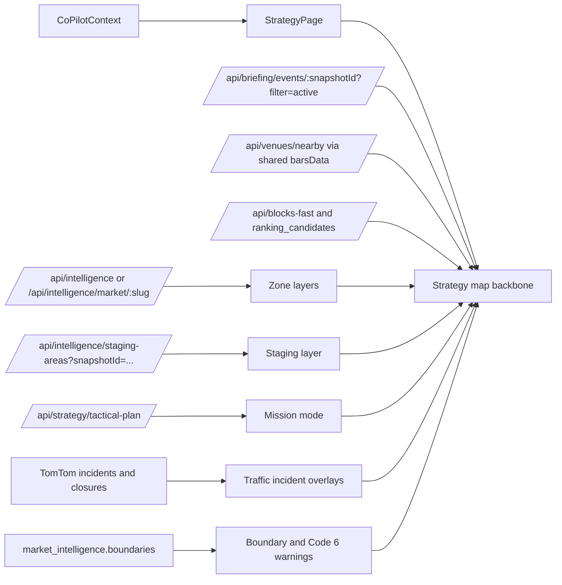

# Market Intelligence Map Consolidation Audit

## Executive summary

The repo is already partway through the consolidation you want. The live Strategy page now embeds the shared Google map component directly, which means the separate `/co-pilot/map` surface is no longer the canonical experience; it is a duplicate wrapper around the same `MapTab` data path. At the same time, the route and bottom navigation still expose the standalone Map page, so removing the Map tab is not just a visual cleanup—it requires coordinated edits in `client/src/routes.tsx` and `client/src/components/co-pilot/BottomTabNavigation.tsx`. 

The main architectural gap is not “getting a map into Strategy”—that has already happened. The real remaining gap is that the current Strategy map still renders only driver, strategy venues, bars, currently-active events, and Google’s native traffic layer. The repo already has server-side ingredients for zone intelligence, staging areas, tactical AI zones, market boundaries, demand patterns, and TomTom incident/closure data, but those layers are either disabled, not wired to the main map, or only consumed indirectly for AI context instead of visual rendering. The project’s own map architecture doc explicitly says zone overlays are not rendered on the main map yet. 

The uploaded Claude Code plan is directionally useful, but several implementation details are wrong or need tightening before you turn it into a deletion plan. The biggest corrections are these: the staging-areas endpoint takes `snapshotId`, not `market`; `/api/intelligence/markets` returns counts, not boundary polygons; the intelligence API filters by `type` and `subtype`, not `zone_type`; the bottom navigation currently defines seven tabs, so deleting Map removes one of seven, not “one of five” or “down to four”; and there is a taxonomy mismatch between the documented zone types and the server whitelist actually accepted by the intelligence API. 

My highest-confidence conclusion is this: keep Strategy as the single consumer, keep the existing map component as the backbone, remove the duplicate Map route and Map tab, fold the disabled tactical mission/staging logic into the Strategy map, and treat TomTom incidents, market zones, and boundaries as new layer inputs instead of building another map surface. Concierge map code looks very likely to be dead, but I would classify it as a “probable delete” rather than an unconditional delete until you run one last local import grep in your checkout. 

## Information needs and method

To answer this well, I needed to resolve five concrete questions. First, which map-capable client surfaces are live, duplicated, disabled, or likely orphaned. Second, which data sources already feed the current Strategy map versus which geo/intelligence sources exist only elsewhere in the repo. Third, which server routes and DB-backed intelligence surfaces are already sufficient for the overlays you want, so that you do not over-delete backend code that should instead be reused. Fourth, where the uploaded Claude plan misstates route contracts or current UI state. Fifth, which file removals or line edits are safe immediately versus only safe after feature folding is complete. 

The primary repo files I inspected were the ones that govern route exposure, current Strategy rendering, map behavior, intelligence consumption, and tactical AI staging: `client/src/components/MapTab.tsx`, `client/src/pages/co-pilot/StrategyPage.tsx`, `client/src/pages/co-pilot/MapPage.tsx`, `client/src/components/co-pilot/BottomTabNavigation.tsx`, `client/src/routes.tsx`, `client/src/components/RideshareIntelTab.tsx`, `client/src/components/intel/TacticalStagingMap.tsx`, `client/src/components/concierge/ConciergeMap.tsx`, `client/src/components/concierge/EventsExplorer.tsx`, `client/src/pages/concierge/PublicConciergePage.tsx`, `client/src/hooks/useBriefingQueries.ts`, `client/src/hooks/useMarketIntelligence.ts`, `client/src/constants/apiRoutes.ts`, `server/api/intelligence/index.js`, `server/api/strategy/tactical-plan.js`, `server/lib/traffic/tomtom.js`, `server/bootstrap/routes.js`, plus the architecture docs `docs/architecture/MAP.md` and `docs/architecture/MARKET_INTELLIGENCE.md`. I also used your uploaded Claude audit as a secondary comparison source, especially where it already captured exact line numbers for cleanup candidates. 

For exact deletion coordinates, I used two sources. Where GitHub blob pages were accessible, I pulled precise route and navigation line numbers from the repo’s GitHub pages. Where the connector returned whole-file blobs without per-line ranges, I relied on the uploaded Claude audit’s quoted line references and then checked the corresponding file logic in the repo itself to see whether the claim was substantively correct. That means some exact line numbers in the cleanup ledger below come from the uploaded audit rather than directly from the connector blob view. 

## Current runtime map inventory

The current runtime picture is more concentrated than the old naming suggests. There are really two live runtime experiences using the same core map logic, one disabled tactical map surface holding fold-worthy capabilities, and a likely dead concierge map scaffold. The Strategy page is already the de facto backbone. 

| Surface | Current status | What it renders now | Why it matters for consolidation |
|---|---|---|---|
| `client/src/components/MapTab.tsx` | Live core map | Driver marker, strategy venue markers, $$+ bar/lounge markers, today-filtered event markers, Google `TrafficLayer`, InfoWindows, legend.  | This is the keeper. It already contains the shared marker/legend behavior you want to preserve. |
| `client/src/pages/co-pilot/StrategyPage.tsx` | Live and now primary | Embeds `MapTab` directly, using `blocks`, shared `barsData`, and `useActiveEventsQuery(lastSnapshotId)`, with a progressive “show map as soon as coords land” behavior.  | This is already your single best client consumer; future consolidation should flow here, not into another tab. |
| `client/src/pages/co-pilot/MapPage.tsx` | Live duplicate wrapper | Rebuilds the same map inputs and passes them to `MapTab`; comments explicitly describe it as a wrapper page for the Map tab.  | Strong candidate for deletion once route and nav references are removed. |
| `client/src/components/intel/TacticalStagingMap.tsx` | Disabled but feature-rich | Mission selector, airport/event targets, staging markers, avoid markers, AI tactical-plan call, staging-areas fetch, separate legend, traffic layer.  | Do not preserve as a separate map surface; fold its mission/staging capabilities into the Strategy map and then delete it. |
| `client/src/components/RideshareIntelTab.tsx` | Live intel page, map block disabled | Zone cards, strategies, safety, timing, demand chart; tactical map is explicitly disabled, and some other intel visualizations are still `false &&` gated.  | Intel remains a hub page, but not the right place for a second map. It should become a data/layer source, not a competing map consumer. |
| `client/src/components/concierge/ConciergeMap.tsx` and `EventsExplorer.tsx` | Probable dead scaffold | ConciergeMap can render passenger/venue/event markers with escaped InfoWindow content; EventsExplorer can fetch nearby venues/events and was designed to pass results upward.  | Useful code patterns exist here, but current public concierge page does not render either component, so these look like probable deletion candidates rather than live dependencies. |
| `client/src/pages/concierge/PublicConciergePage.tsx` | Live public page | Imports `DriverCard`, `AskConcierge`, and API routes; it does not itself mount a map component in the current render path.  | Supports the conclusion that the concierge map scaffold is not part of the live passenger experience today. |

Two current behaviors are especially important for your strategy-map plan. First, the “event” layer is narrower than it sounds: both Strategy and MapPage source their event markers from `useActiveEventsQuery`, which fetches only events happening now, and then `MapTab` filters again to “today” before rendering. In other words, the current event layer is the intersection of “active now” and “today,” not the broader discovered-event universe. If you want forecasted markers or all high-impact same-day events, this logic has to change. 

Second, the current viewport logic in `MapTab` fits bounds using driver/venue markers and event markers, but not bar markers. That is a subtle integration bug the uploaded plan did not call out. If bars or future zone overlays lie outside the venue/event envelope, they do not influence the initial viewport. When you consolidate more layers into the Strategy map, the bounds calculation should become layer-aware rather than hard-coded to only two marker arrays. 

## Corrections and missed findings

The uploaded Claude audit was useful, but some of its implementation details would send your cleanup in the wrong direction if you took them literally.

| Claude-plan claim | Repo reality | Why this matters |
|---|---|---|
| “`GET /api/intelligence/staging-areas?market=X`” is the staging-layer source. fileciteturn74file0L108-L116 | The actual client constant and Express route both require `snapshotId`, not `market`. The route fetches staging coordinates from `ranking_candidates` for that snapshot.   | If you rewrite the Strategy map to ask for `market`, the layer will fail. Keep this endpoint and call contract exactly as-is unless you deliberately change the server. |

| “Market boundary” can come from `GET /api/intelligence/markets`. fileciteturn74file0L112-L116 | `/api/intelligence/markets` returns counts by market; it does not return per-item `boundaries`. Boundary data, if stored, lives on intelligence rows themselves and would need to come from `GET /api/intelligence`, `GET /api/intelligence/market/:slug`, or a dedicated boundary endpoint. | This is a hard contract correction. Do not build the boundary layer on `/markets`. |

| Zone layers can be fetched with `zone_type=honey_hole` style filters. | The authenticated intelligence API filters by `type` and `subtype`; the market-specific route supports `type` and `platform` only. If you want subtype filtering server-side, the current safer contract is `GET /api/intelligence?market=<slug>&type=zone&subtype=<value>`, or fetch the market payload and filter on the client. | This affects your hook design for honey-hole, dead-zone, and danger-zone layers. |

| Removing the Map tab leaves a much smaller bottom nav.  | The current bottom nav config defines Strategy, Coach, Lounges & Bars, Briefing, Map, Translate, and Concierge. Deleting Map removes one of seven configured tabs, not one of five or “down to four,” unless another part of the app conditionally hides tabs outside this file.  | This matters for UX signoff and for your post-delete test plan. |
| Tactical staging should be removed because it is disabled.  | The map surface is disabled, but the feature logic is valuable: it already knows how to source event/airport missions, fetch precomputed staging zones, and call the tactical AI route.  | Delete the surface only after folding the capability into the Strategy map. |
| The current Strategy map is still mostly future work. fileciteturn74file0L49-L67 | Strategy already embeds the map and was explicitly changed to render the map as soon as coordinates land, with data layering in progressively.  | Your consolidation is partly complete already; the remaining work is dedupe plus new layers. |

I found four additional issues that the uploaded plan did not emphasize strongly enough. The first is that TomTom road closures, lane closures, jams, and accidents already exist server-side, but today they do not render as map overlays. `server/lib/traffic/tomtom.js` produces structured incidents and closure counts, while the client map only turns on Google’s generic `TrafficLayer`. In `RideshareIntelTab`, traffic is converted to `trafficContext` and sent into the AI tactical planner, but not visualized directly. That means your “TomTom-enhanced data on the map” goal is an additive client-layering job, not a missing backend job. 

The second is a schema/enum mismatch around zone types. The map architecture doc describes zone concepts including `surge_trap`, `staging_spot`, and `event_zone`, but the active intelligence API whitelist exposes only `honey_hole`, `danger_zone`, `dead_zone`, `safe_corridor`, and `caution_zone` as accepted subtypes for market-intelligence CRUD and filtering. If you want to add surge-zone and staging-spot overlays through the current intelligence API, you should reconcile the doc/schema vocabulary with the route whitelist before you rely on those names in the client. 

The third is a security inconsistency. `ConciergeMap.tsx` contains an explicit `escapeHtml()` helper and comments explaining why Google Maps `InfoWindow.setContent()` must not receive raw AI/user strings, but `MapTab.tsx` and `TacticalStagingMap.tsx` still build HTML strings by interpolation for venues, bars, events, and tactical zones without an equivalent escape layer. I am making an inference here, but it is a strong one: the public-page XSS hardening pattern was not carried back into the internal maps. If you keep and enhance the Strategy map, bring that escape pattern with you. 

The fourth is that the Intel page still contains dormant, not-yet-consolidated visualization branches beyond the tactical map. `RideshareIntelTab.tsx` imports `MarketBoundaryGrid` and `MarketDeadheadCalculator`, but both are wrapped in `false && ...` guards, which means pieces of “market structure visualization” already exist as disabled UI outside the main map. Those are not reasons to keep a second map, but they are signs that the repo still has unfinished intelligence-display branches you should consciously classify as either fold, revive, or delete. 

## Deletion and cleanup ledger

This ledger separates immediate-safe cleanup from delete-only-after-fold cleanup, which is the distinction that matters most if you want to avoid cutting away backend or layer logic you still need.

| Action class | File or line range | Recommendation | Evidence |
|---|---|---|---|
| Immediate route cleanup once you commit to removing the Map tab | `client/src/routes.tsx` import of `MapPage` at line 654; child route `path: 'map'` / `element: <MapPage />` at lines 880–882 | Remove together in the same change. If you delete `MapPage.tsx` first, the route will break. |  |
| Immediate nav cleanup once you commit to removing the Map tab | `client/src/components/co-pilot/BottomTabNavigation.tsx` tab object spanning lines 668–677 | Remove the Map tab object in the same PR as the route deletion. |  |
| Immediate whole-file deletion after the two edits above | `client/src/pages/co-pilot/MapPage.tsx` | Safe delete after route + bottom-nav references are removed, because Strategy already embeds the same map payload path. | 
|
| Immediate bug fix even if you postpone all other consolidation | The `MapTab.tsx` script-removal cleanup at the lines the uploaded audit identifies as 197–199 | Replace direct script removal with a singleton loader strategy; this is the likely root cause of the shared Google Maps `removeChild` breakage. | 
|
| Delete only after feature folding | `client/src/components/intel/TacticalStagingMap.tsx` | Do not delete yet if you still need mission mode, staging zones, avoid zones, or the tactical-plan button. Delete after those abilities move into the Strategy map. | 
|
| Delete matching dead block after the fold above | `client/src/components/RideshareIntelTab.tsx` disabled tactical-map render block, referenced in the uploaded audit as lines 455–465 | Remove only when the Strategy map fully subsumes mission/staging behavior. | 

| Delete only after types are relocated | `client/src/types/tactical-map.ts` | Delete after you either move the types into the consolidated map module or create a new shared layer-types module. | 
|
| Probable whole-file deletions | `client/src/components/concierge/ConciergeMap.tsx` and `client/src/components/concierge/EventsExplorer.tsx` | These look unused in the current runtime surfaces I inspected. I would still confirm with one final local import grep before deleting. | 
|
| Documentation cleanup after code cleanup | `docs/architecture/MAP.md` | Update after deletion/folding, because it currently describes three active Google Maps components and says staging maps are “working.” |  |

Three items should **not** be deleted as part of a map-tab cleanup, even though they are geo-related. `server/lib/traffic/tomtom.js` should stay because it is exactly where your road-closure and incident overlay data comes from. `server/api/intelligence/index.js` should stay because it is already the route family for market intel, zone rows, staging areas, and demand patterns. `client/src/contexts/location-context-clean.tsx` and `client/src/pages/concierge/PublicConciergePage.tsx` should stay because they are not alternate map surfaces; they are location-resolution and public concierge consumers. 

## Recommended consolidation blueprint

The strongest backbone is to treat the current Strategy-page map as the single visual map surface and move every other geo feature into it as a layer or mode, rather than keeping multiple React pages that all separately load Google Maps. In practical terms, that means: Strategy stays the only map consumer; the current `MapTab` becomes your single Strategy map component; the tactical mission/staging behaviors are folded in from `TacticalStagingMap`; and Market Intelligence, TomTom, and boundary data become layer inputs rather than separate map UIs. That matches the repo’s actual runtime center of gravity much better than the older “Map tab as a first-class surface” model. fileciteturn46file0L1-L1 fileciteturn45file0L1-L1 fileciteturn49file0L1-L1 fileciteturn50file0L1-L1



A singleton Google Maps loader should be the first change, even before route deletion. The uploaded audit accurately identifies the root-cause class: `MapTab` removes the script on unmount, while `TacticalStagingMap` explicitly does not. `ConciergeMap` also follows the safer pattern of reusing an existing script rather than yanking it back out of the DOM. Centralizing loading into one module eliminates the shared-script lifecycle race and gives you one place to add any needed libraries for geometry or newer marker APIs later. 

For layer design, I would treat the repo’s existing data sources as six distinct families, each with its own dedupe key and viewport participation rule. Strategy venues come from the blocks pipeline. Premium bars/lounges come from shared `barsData`. Events come from `useActiveEventsQuery` unless you intentionally widen event scope later. Tactical staging/avoid zones come from the tactical map logic and related endpoints. Market-intelligence zones and boundaries come from the intelligence routes. TomTom incidents and closures come from the briefing traffic pipeline. Each family should have its own memoized key and marker/overlay registry, because the repo already contains one proven fix pattern—`lastEventKeyRef`—for suppressing re-add thrash on re-renders, and that pattern should be generalized to every added layer. 

The endpoint strategy should be corrected before you implement the new layers. For stages/mission mode, keep `/api/intelligence/staging-areas?snapshotId=...` and `/api/strategy/tactical-plan`. For market intel overlays, do **not** build on `/api/intelligence/markets`; instead use `/api/intelligence/market/:slug` or the filtered list endpoint and extract rows carrying zone content or `boundaries`. For demand rhythm, the existing route is `/api/intelligence/demand-patterns/:marketSlug`. For event markers beyond “active now,” you would need to switch away from `useActiveEventsQuery` and use a broader briefing/discovered-events source. 

One design change I would add to the uploaded plan is a shared “sanitize before InfoWindow HTML” utility. The public concierge map already codifies the secure pattern. Reusing that discipline in the Strategy map would let you consolidate not only map features, but also the safer string-to-InfoWindow implementation that the public surface already received. I would also update bounds calculation so enabled bars, zones, and tactical layers influence `fitBounds`, because the current map omits bar-marker participation and future layers will otherwise feel “broken” even when rendering correctly. 

## Dictionary template and limitations

If you want to turn this research into a machine-readable dictionary for future audits, the cleanest shape is not just “file to status,” but “surface to capabilities and contracts.” Each record should capture the surface, runtime status, current consumer, data sources, endpoint contracts, DB dependencies, cleanup actions, and post-consolidation fate. That will let you reuse the dictionary later for tests, code removal, or an internal feature registry. The field suggestions below are synthesized from the repo structures above. 

```json
{
  "surfaceId": "strategy.map",
  "file": "client/src/components/MapTab.tsx",
  "status": "keep_and_expand",
  "runtimeState": "live",
  "consumers": [
    "client/src/pages/co-pilot/StrategyPage.tsx",
    "client/src/pages/co-pilot/MapPage.tsx"
  ],
  "layers": [
    {
      "id": "driver",
      "source": "useCoPilot().coords",
      "renderType": "marker",
      "enabled": true
    },
    {
      "id": "strategy_venues",
      "source": "useCoPilot().blocks",
      "renderType": "marker",
      "enabled": true
    },
    {
      "id": "bars_lounges",
      "source": "useCoPilot().barsData",
      "renderType": "marker",
      "enabled": true
    },
    {
      "id": "active_events",
      "source": "useActiveEventsQuery(snapshotId)",
      "renderType": "marker",
      "enabled": true
    }
  ],
  "apiDependencies": [
    "/api/briefing/events/:snapshotId?filter=active",
    "/api/intelligence/staging-areas?snapshotId=:snapshotId",
    "/api/strategy/tactical-plan"
  ],
  "dbDependencies": [
    "ranking_candidates",
    "market_intelligence",
    "zone_intelligence"
  ],
  "cleanup": [
    {
      "type": "route_delete",
      "file": "client/src/routes.tsx",
      "lines": "654, 880-882"
    },
    {
      "type": "nav_delete",
      "file": "client/src/components/co-pilot/BottomTabNavigation.tsx",
      "lines": "668-677"
    }
  ],
  "issues": [
    "shared Google Maps script lifecycle",
    "bar markers excluded from fitBounds",
    "InfoWindow HTML not escaped",
    "event layer is active-now only"
  ],
  "postConsolidationFate": "single_strategy_surface"
}
```

The largest limitation on exact line-numbering is the tool mix, not the repo analysis. The GitHub connector exposed whole-file content for several primary files but not always blob-style line ranges, so the exact deletion coordinates I can state with the highest confidence are the route and bottom-nav lines from GitHub blob view plus the internal file line references already captured in your uploaded Claude audit. I have therefore been explicit about which line numbers come from direct repo line views and which come from the uploaded audit’s line annotations. 

A second limitation is the concierge orphan determination. The evidence I reviewed strongly suggests that `ConciergeMap.tsx` and `EventsExplorer.tsx` are not connected to the live public concierge flow, and your uploaded audit reaches the same conclusion. Still, because I did not have a full local dependency graph or AST import index from the repo checkout, I am keeping those in the “probable delete” bucket instead of claiming absolute certainty. Everything else in this report—the Strategy-map backbone, MapPage duplication, route/nav cleanup, TacticalStagingMap fold-then-delete path, TomTom overlay opportunity, and endpoint-contract corrections—is high confidence. 