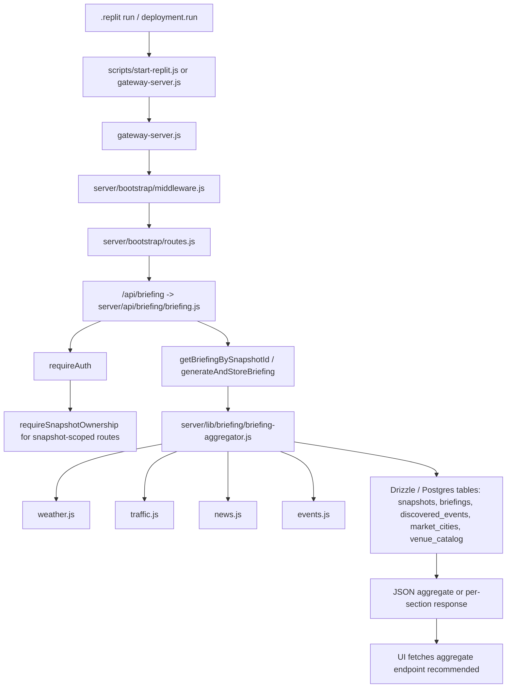

# Surgical Audit of Root Server Scripts Hooks and Briefing Pipeline

## Executive summary

The repo’s current startup contract is **not singular**. Replit workspace execution runs `node scripts/start-replit.js` after sourcing `./.env.local`, while Replit deployment runs `node gateway-server.js` directly, and the workspace workflow starts `agent-server.js` in parallel on a second port. That means **workspace, workflow, and deployment do not enter the system through the same code path**. In practice, that creates three different runtime shapes for env loading, `NODE_ENV`, agent lifetime, and health-gate behavior. That is the strongest single explanation for “prod has issues but dev doesn’t.” `.replit` proves the split entrypoints; `scripts/start-replit.js` proves it mutates environment state before spawning the gateway; and `gateway-server.js` proves the gateway itself also performs its own environment loading and capability gating. fileciteturn21file0L3-L3 fileciteturn33file0L3-L3 fileciteturn23file0L3-L3

The second major finding is that the codebase contains **multiple powerful hook surfaces** beyond ordinary API routes: a boot wrapper, process-level exception/signal hooks, SSE hooks, background-worker hooks, snapshot-observer hooks, agent bridge and WebSocket hooks, ability routes, shell execution hooks, SQL execution hooks, config-edit hooks, and external hooks under `/api/hooks`. The highest-risk attack surfaces are the **agent server** (`/agent/shell`, `/agent/sql/*`, `/agent/config/*`, `/agent/context/*`), the **embedded agent bridge/WebSocket surface**, and the **external hooks** mounted under `/api/hooks`. Those are high-risk because they touch command execution, file IO, database execution, configuration mutation, or external ingress. That maps directly to OWASP API categories for broken authentication, unrestricted resource consumption, sensitive business flows, security misconfiguration, and improper inventory management. fileciteturn29file0L3-L3 fileciteturn31file0L3-L3 fileciteturn24file0L3-L3 fileciteturn20file0L1-L3 fileciteturn20file1L1-L3 citeturn2search1turn2search0turn2search11turn2search8

The third major finding is the **briefing pipeline is partly modernized on the server side but still architecturally fragile**. The server has clearly moved toward an aggregate endpoint (`/api/briefing/snapshot/:snapshotId`) specifically to eliminate a “6-way race” and to surface section-level `_generationFailed` sentinels. That is a sound direction. But the pipeline still has multiple failure gates: auth/session enforcement, snapshot ownership, missing timezones, zombie briefing rows, DB lookups, and section-specific pipeline failures. The strongest remediation is to make the aggregate route the canonical UI contract, de-emphasize per-section polling routes, and eliminate startup/env divergence so the same worker/SSE/DB behavior exists in workspace and deployment. fileciteturn34file0L3-L3 fileciteturn23file0L3-L3

Replit’s own docs support using `.replit` as the authoritative execution contract, with distinct `run`, `deployment.build`, and `deployment.run` commands. That strengthens the recommendation to **collapse the repo onto one canonical startup path** rather than maintaining separate workspace and deployment launch logic. Express’s security guidance also supports the hardening already visible in `server/bootstrap/middleware.js`: use Helmet, reduce fingerprinting, and protect auth flows against brute force. citeturn2search6turn3search1

## Replit startup contract and environment branching

The `.replit` file is the root of truth for how Replit launches this app, and it currently defines **three materially different behaviors**. First, the workspace `run` command sources `./.env.local` and then starts `node scripts/start-replit.js` (`.replit:5-7`). Second, deployment skips that wrapper and uses `node gateway-server.js` directly (`.replit:15-18`). Third, the workflow runs **two tasks in parallel**: the same `start-replit.js` path for the gateway on port `5000`, and `agent-server.js` on port `43717` (`.replit:26-42`). That means your gateway and agent lifetime differ by environment even before application code runs. fileciteturn21file0L3-L3

`scripts/start-replit.js` then deepens that branch. It parses env files itself (`scripts/start-replit.js:34-67`), detects `REPLIT_DEPLOYMENT` (`:76-79`), but then unconditionally logs “Local development mode - full bootstrap” and **forces `NODE_ENV='production'` unless `FORCE_DEV=1`** (`:92-99`). It also clears port `5000`, opportunistically builds the client, spawns `gateway-server.js`, waits on `/health`, and handles its own shutdown signals (`:108-124`, `:141-154`, `:167-215`). That is a second environment policy layer layered on top of `.replit`, not merely a thin launcher. fileciteturn33file0L3-L3

`gateway-server.js` is a third policy layer. It independently calls `loadEnvironment()` and `validateOrExit()` (`gateway-server.js:30-31`), derives mode from `APP_MODE` (`:35`), derives deployment from `REPLIT_DEPLOYMENT` (`:41`), derives autoscale from `CLOUD_RUN_AUTOSCALE` or `REPLIT_AUTOSCALE` (`:43-46`), and changes uncaught-exception behavior based on `NODE_ENV` (`:61-63`). So even if the boot script starts the gateway in a “production-shaped” local session, the gateway itself still performs its own branching. fileciteturn23file0L3-L3

`package.json` adds yet another layer of startup branching. The declared main is `gateway-server.js`; `start` hard-sets `NODE_ENV=production node gateway-server.js`; `dev` hard-sets development mode; `start:replit` runs `node scripts/start-replit.js`; and `agent` runs `node agent-server.js` (`package.json:5-21`). This is not inherently wrong, but in combination with `.replit` and `scripts/start-replit.js` it produces **multiple overlapping control planes** for env selection. fileciteturn22file0L3-L3

The strongest configuration conclusion is this: **`NODE_ENV` is being used as a deployment proxy, a runtime behavior switch, and a boot-script override all at once**. That is structurally brittle. Replit’s docs explicitly separate runtime `run` commands and deployment `build/run` commands, which supports moving to a single launch contract instead of forcing runtime identity inside application code. citeturn2search6

### Environment and config branching inventory

| File | Exact lines | Branch / config behavior | Why it matters | Recommended fix |
|---|---:|---|---|---|
| `.replit` | 5-7 | Workspace `run` sources `.env.local` then runs `scripts/start-replit.js` | Workspace path differs from deployment | Make workspace and deployment use the same canonical boot entrypoint. fileciteturn21file0L3-L3 |
| `.replit` | 15-18 | Deployment runs `node gateway-server.js` directly | Skips boot wrapper logic entirely | Either use the wrapper everywhere or eliminate the wrapper. fileciteturn21file0L3-L3 |
| `.replit` | 26-42 | Workflow starts gateway and agent in parallel | Agent lifetime differs between workflow and deployment | Decide whether agent is embedded, standalone, or both; do not mix by environment. fileciteturn21file0L3-L3 |
| `package.json` | 7-21 | `start`, `dev`, `start:replit`, `agent` all choose different launch shapes | Multiple startup contracts | Reduce to one canonical production path and one local-dev path. fileciteturn22file0L3-L3 |
| `scripts/start-replit.js` | 76-79 | `REPLIT_DEPLOYMENT` detection | Extra deployment policy in wrapper | Move deployment-mode decisions into one env module. fileciteturn33file0L3-L3 |
| `scripts/start-replit.js` | 92-99 | Forces `NODE_ENV=production` unless `FORCE_DEV=1` | Local session may masquerade as prod | Stop mutating `NODE_ENV` in the launch wrapper. Use explicit flags instead. fileciteturn33file0L3-L3 |
| `gateway-server.js` | 35-46 | `APP_MODE`, `REPLIT_DEPLOYMENT`, `CLOUD_RUN_AUTOSCALE`, `REPLIT_AUTOSCALE` | Capability gating split across four flags | Replace with one deployment mode flag + one worker flag. fileciteturn23file0L3-L3 |
| `gateway-server.js` | 61-63 | Process exit on uncaught exception only outside prod | Different failure semantics by env | Prefer consistent crash policy with external supervision. fileciteturn23file0L3-L3 |
| `agent-server.js` | 44-49 | `BASE_DIR`, `AGENT_PORT`, `AGENT_HOST`, `REPL_ID`, `NODE_ENV` | Agent binds by env and exposes host/port differences | Narrow binding and remove unnecessary environment inference. fileciteturn29file0L3-L3 |
| `agent-server.js` | 72-75 | DB SSL toggles on `REPLIT_DEPLOYMENT` or prod | DB connection behavior changes by env | Centralize DB client policy in one DB module. fileciteturn29file0L3-L3 |
| `server/bootstrap/workers.js` | 169-194 | Worker allowed only when not autoscale and `ENABLE_BACKGROUND_WORKER='true'` | Background execution depends on env matrix | Good direction; keep this as the single worker gate. fileciteturn27file0L3-L3 |
| `server/bootstrap/middleware.js` | 132-149 | `CORS_ALLOWED_ORIGINS` plus built-in exceptions for Replit/localhost/custom domain | Security policy varies by env and host shape | Keep but document as authoritative CORS policy. fileciteturn25file0L3-L3 |
| `server/middleware/auth.js` | 116-129 | Legacy HMAC verifier uses `JWT_SECRET` or `REPLIT_DEVSERVER_INTERNAL_ID` | Legacy fallback increases auth branching and downgrade surface | Retire legacy verifier and one-token-source fallback. fileciteturn32file0L3-L3 |
| Additional env-sensitive files identified by connector search | `server/config/load-env.js`, `server/config/env-registry.js`, `server/config/validate-env.js`, `server/db/connection-manager.js`, `server/db/db-client.js`, `drizzle.config.js`, `.env.local.example`, `mono-mode.env.example`, `start-mono.sh`, `scripts/db-detox.js`, `scripts/diagnose.js` | Discovered by `REPLIT_DEPLOYMENT`, `NODE_ENV`, `DATABASE_URL`, `REPL_ID`, `DATABASE_URL` searches | They are in scope and likely contain more branching | Highest-priority follow-up after startup unification. fileciteturn16file1L1-L3 fileciteturn18file24L1-L3 fileciteturn18file29L1-L3 fileciteturn16file12L1-L3 fileciteturn18file25L1-L3 fileciteturn18file3L1-L3 fileciteturn16file6L1-L3 fileciteturn17file4L1-L3 fileciteturn18file1L1-L3 fileciteturn18file45L1-L3 fileciteturn16file9L1-L3 |

## Hook catalog and attack surface

### Full hook catalog

The table below catalogs the **actual hook surfaces** in `root`, `server`, and `scripts` that either start processes, mount routes/middleware, keep background lifecycle, proxy traffic, or expose admin-like capabilities.

| Hook type | File and exact lines | What it serves | How / when invoked | API attack-vector risk |
|---|---|---|---|---|
| Workspace startup hook | `.replit:5-7` | Canonical Replit workspace run command | Run button / preview boot | **High** — sources `.env.local` only in workspace path. fileciteturn21file0L3-L3 |
| Deployment startup hook | `.replit:15-18` | Deployment build/run contract | Replit deployment container start | **Medium** — bypasses wrapper used in workspace. fileciteturn21file0L3-L3 |
| Parallel workflow hooks | `.replit:26-42` | Starts gateway and standalone agent | Workflow run button | **High** — dual-process topology differs from deployment. fileciteturn21file0L3-L3 |
| NPM script hooks | `package.json:7-34` | Alternative launch/test/db entrypoints | CLI / tooling | **Medium** — many startup shapes. fileciteturn22file0L3-L3 |
| Boot wrapper | `scripts/start-replit.js:23-27, 34-67, 76-99` | Env parsing, deployment detection, `NODE_ENV` mutation | Workspace startup only | **High** — mutates runtime identity before gateway start. fileciteturn33file0L3-L3 |
| Boot process spawn hook | `scripts/start-replit.js:141-154` | Spawns `gateway-server.js` and exits on child exit | Wrapper runtime | **Medium** — parent/child lifecycle split. fileciteturn33file0L3-L3 |
| Boot health gate | `scripts/start-replit.js:167-206` | Polls `/health` before declaring success | Wrapper runtime | **Low** — availability hook, but can hide route readiness mismatch. fileciteturn33file0L3-L3 |
| Boot signal hooks | `scripts/start-replit.js:208-215` | SIGTERM/SIGINT forwarding | Process shutdown | **Low**. fileciteturn33file0L3-L3 |
| Gateway process-level hooks | `gateway-server.js:22-28, 61-68, 220-238, 249-259` | Warning interception, uncaught handlers, shutdown, AI health polling | Always at gateway boot | **Medium** — lifecycle-critical, plus long-running interval. fileciteturn23file0L3-L3 |
| Gateway env/capability hooks | `gateway-server.js:35-46` | Deployment/autoscale mode gating | Before app mount | **High** — behavior changes across environments. fileciteturn23file0L3-L3 |
| Health endpoints hook | `server/bootstrap/health.js:17-42` | `/healthz`, `/health`, `/ready`, HEAD variants | Mounted early by gateway | **Low** — public probes, but exposed inventory surface. fileciteturn26file0L3-L3 |
| Health router mount hook | `server/bootstrap/health.js:49-58` | Mounts `/api/health` router | Gateway boot | **Low**. fileciteturn26file0L3-L3 |
| Bot blocker hook | `server/bootstrap/middleware.js:21-30` | Global scanner/bot rejection | First middleware in gateway | **Medium** — protective, but any false positives block traffic. fileciteturn25file0L3-L3 |
| Header/CSP/Permissions hooks | `server/bootstrap/middleware.js:33-36, 90-128` | `X-Robots-Tag`, Helmet CSP/HSTS, Permissions-Policy | Every gateway response | **Medium** — security hardening and UI compatibility hinge. fileciteturn25file0L3-L3 |
| CORS hooks | `server/bootstrap/middleware.js:132-177` | Origin allowlist, edge 403, cors middleware | Every cross-origin request | **High** — misconfig here breaks prod or weakens CSRF/CORS boundary. fileciteturn25file0L3-L3 |
| Global rate-limit hooks | `server/bootstrap/middleware.js:182-195` | API/health/realtime limiters | Every API request | **Medium** — necessary for auth and abuse resistance. fileciteturn25file0L3-L3 |
| JSON body-size hooks | `server/bootstrap/middleware.js:207-214` | Route-specific body limits | `/api/chat`, `/api/hooks`, `/api`, `/agent` | **Medium** — oversized payload avenue is deliberately widened for chat/hooks. fileciteturn25file0L3-L3 |
| Error middleware hook | `server/bootstrap/middleware.js:223-233` | Global 503/error adaptation | Last middleware | **Medium** — central failure translation. fileciteturn25file0L3-L3 |
| Dynamic route-mount helper | `server/bootstrap/routes.js:17-26` | Imports routers dynamically and mounts them | Gateway boot | **Medium** — failures degrade routes at boot. fileciteturn24file0L3-L3 |
| API route manifest hook | `server/bootstrap/routes.js:45-115` | Registers all domain routers, including `/api/briefing`, `/api/auth`, `/api/hooks`, `/api/logs` | Gateway boot | **High** — this is the external API inventory. fileciteturn24file0L3-L3 |
| Agent embed mount hook | `server/bootstrap/routes.js:139-151` | Embeds `/agent` routes and WS on gateway server | Gateway boot | **High** — gateway-to-agent bridge surface. fileciteturn24file0L3-L3 |
| SDK catch-all hook | `server/bootstrap/routes.js:155-164` | Catch-all `/api` fallback router | Mounted last | **High** — improper inventory / shadow routes risk. fileciteturn24file0L3-L3 |
| SSE mount hook | `server/bootstrap/routes.js:178-187` | Strategy/SSE endpoints at `/` | Non-autoscale gateway boot | **Medium** — long-lived connections / shutdown complexity. fileciteturn24file0L3-L3 |
| Unified capability hook | `server/bootstrap/routes.js:196-205` | Health/capability introspection route mount | Gateway boot | **Low/Medium** — reconnaissance if overexposed. fileciteturn24file0L3-L3 |
| Child-process restart hooks | `server/bootstrap/workers.js:30-65, 82-155` | Worker spawn, exit handling, restart backoff | Post-listen background bootstrap | **Medium** — stability and DB-pressure surface. fileciteturn27file0L3-L3 |
| Worker gate hook | `server/bootstrap/workers.js:169-194` | Explicit worker eligibility | Gateway after listen | **Medium** — good single control point. fileciteturn27file0L3-L3 |
| Legacy alternate startup stack | `index.js:17-18, 23-28, 37-50, 56-171, 174-195` | Separate HTTP shim, lazy Express swap, alternate API mounts, signal hooks | Not current `.replit` entrypoint but still runnable | **High** — classic API inventory problem if ever invoked accidentally. fileciteturn28file0L3-L3 |
| Agent public health hooks | `agent-server.js:201-202, 232-249` | `/health`, `/ready`, `/agent/health`, `/healthz` | Standalone agent boot | **Low/Medium** — infra probes and service identification. fileciteturn29file0L3-L3 |
| Agent middleware hooks | `agent-server.js:208-226` | CORS, body parsing, global rate limit | All standalone agent traffic | **High** — current CORS is permissive (`origin: true`). fileciteturn29file0L3-L3 |
| Agent auth + ability hooks | `agent-server.js:257-283` | Bearer token gate, shell whitelist gate, mounted ability routes | `/agent/*` parity routes | **High** — privileged internal API. fileciteturn29file0L3-L3 |
| Agent legacy FS hooks | `agent-server.js:292-361` | `/agent/fs/read`, `/agent/fs/write` | Legacy internal API | **High** — file IO and config-touching capabilities. fileciteturn29file0L3-L3 |
| Agent shell hook | `agent-server.js:368-425` | `/agent/shell` | Legacy internal API | **High** — command execution. Node docs explicitly warn against unsanitized command execution. fileciteturn29file0L3-L3 citeturn3search0 |
| Agent SQL hooks | `agent-server.js:434-477` | `/agent/sql/query`, `/agent/sql/execute` | Legacy internal API | **High** — direct database execution. fileciteturn29file0L3-L3 |
| Agent config hooks | `agent-server.js:482-523` | `/agent/config/*` | Legacy internal API | **High** — config inventory and mutation. fileciteturn29file0L3-L3 |
| Agent context/memory hooks | `agent-server.js:530-647` | `/agent/context*`, `/agent/memory/*`, `/agent/search/internet`, `/agent/analyze/deep` | Legacy internal API | **High** — broad privileged internal surface. fileciteturn29file0L3-L3 |
| Agent listen/error/shutdown hooks | `agent-server.js:684-720` | app.listen, port conflict handling, SIGINT/SIGTERM | Standalone agent boot | **Medium**. fileciteturn29file0L3-L3 |
| Ability-route hooks | `server/lib/ability-routes.js:24-82, 106-179` | Read/list/write, shell exec, capability introspection | Mounted by agentRouter | **High** — standardized admin operations. fileciteturn30file0L3-L3 |
| Embedded agent allowlist/admin hooks | `server/agent/embed.js:8-53, 58-94` | IP allowlist and admin guard | Gateway `/agent` surface | **High** — protection boundary for powerful routes. fileciteturn31file0L3-L3 |
| Embedded agent route/bridge hooks | `server/agent/embed.js:99-155` | Disabled stub, embedded routes, `/health`, `/capabilities`, proxy bridge | Gateway `/agent` surface | **High** — mixed public and privileged endpoints. fileciteturn31file0L3-L3 |
| Embedded agent WS hooks | `server/agent/embed.js:162-235` | WebSocket upgrade, token check, heartbeat, echo | `/agent/ws` | **High** — network-upgrade and token-bearing surface. fileciteturn31file0L3-L3 |
| Auth service-account hooks | `server/middleware/auth.js:34-88` | `x-vecto-agent-secret` / `x-claude-bridge-token` validation | Any route using `requireAuth` or `optionalAuth` | **High** — system-user bypass path by design. fileciteturn32file0L3-L3 |
| Auth token dispatch hooks | `server/middleware/auth.js:97-156` | JWT vs legacy HMAC verification | Any bearer-auth route | **High** — auth downgrade/transition complexity. fileciteturn32file0L3-L3 |
| Auth session-enforcement hook | `server/middleware/auth.js:168-293` | Session checks, sliding/hard expiry, fail-closed DB error handling | Most protected API routes | **High** — core auth gate. fileciteturn32file0L3-L3 |
| Optional-auth hook | `server/middleware/auth.js:301-341` | Anonymous-or-authenticated mixed flow | Routes using `optionalAuth` | **Medium** — must be carefully inventory-managed. fileciteturn32file0L3-L3 |
| Briefing API hooks | `server/api/briefing/briefing.js` imported and mounted via `server/bootstrap/routes.js:66-67`; route handlers observed for `/current`, `/generate`, `/snapshot/:snapshotId`, `/refresh`, `/traffic/realtime`, `/weather/realtime`, `/weather/:snapshotId`, `/traffic/:snapshotId` | Read/generate/refresh briefing data | External client API under `/api/briefing` | **Medium/High** — expensive endpoints, ownership-sensitive, multi-table reads. fileciteturn24file0L3-L3 fileciteturn34file0L3-L3 |
| External hook modules | Mounted at `server/bootstrap/routes.js:111-112`; files `server/api/hooks/analyze-offer.js`, `server/api/hooks/translate.js` | OCR/signals and Siri translation ingress | External hook API under `/api/hooks` | **High** — external ingress with widened body limits. fileciteturn24file0L3-L3 fileciteturn20file0L1-L3 fileciteturn20file1L1-L3 |

### Attack-surface summary table

| Surface | Exposure class | Primary OWASP concern | Why it is the hottest area |
|---|---|---|---|
| `/agent/shell`, `/ability/shell/exec` | Internal-but-networked admin surface | API2, API5, API8 | Command execution plus token/capability complexity. fileciteturn29file0L3-L3 fileciteturn30file0L3-L3 citeturn2search0turn2search11 |
| `/agent/sql/query`, `/agent/sql/execute` | Internal-but-networked admin surface | API1, API5, API10 | Direct object/data access and third-party/DB trust boundary. fileciteturn29file0L3-L3 citeturn2search1turn2search5 |
| `/agent/config/*`, `/agent/fs/*` | Internal-but-networked admin surface | API5, API8, API9 | Configuration mutation and file inventory. fileciteturn29file0L3-L3 citeturn2search11turn2search8 |
| `/agent/ws` | Upgrade / persistent connection | API2, API4 | Authentication and long-lived connection abuse. fileciteturn31file0L3-L3 citeturn2search0turn2search1 |
| `/api/hooks/*` | External ingress | API6, API8, API10 | External trigger surface with larger body limits and translation/OCR semantics. fileciteturn24file0L3-L3 citeturn2search1turn2search5turn2search11 |
| `index.js` legacy server | Shadow API inventory | API9 | Alternate runnable HTTP stack not used by current `.replit`, but still present. fileciteturn28file0L3-L3 citeturn2search8 |
| Startup divergence | Operational control plane | API8, API9 | Different code paths mean different auth, agent, env, and worker behavior across environments. fileciteturn21file0L3-L3 fileciteturn33file0L3-L3 citeturn2search6turn2search8turn2search11 |

## Briefing pipeline end-to-end analysis

### End-to-end request path

The highest-confidence server-side briefing path is:



`server/bootstrap/routes.js` mounts `/api/briefing` from `server/api/briefing/briefing.js` in the gateway route manifest (`routes.js:66-67`). `server/api/briefing/briefing.js` then imports `generateAndStoreBriefing`, `getBriefingBySnapshotId`, `getOrGenerateBriefing`, and the per-section pipeline adapters (`weather`, `traffic`, `news`, `events`) at the top of the file (`briefing.js:1-17`). Those imports are the clearest evidence of the server-side pipeline fan-out. fileciteturn24file0L3-L3 fileciteturn34file0L3-L3

The briefing router exposes several distinct flows. `/current` reads the latest snapshot for the authenticated user and returns a filtered briefing view; `/generate` retrieves a specific snapshot briefing; `/snapshot/:snapshotId` is the aggregate endpoint intended to collapse the multi-request UI race; `/refresh` regenerates the latest snapshot’s briefing; and there are additional realtime/per-section routes for traffic and weather. The aggregate endpoint comment is especially important because it explicitly states the old UI was doing six independent fetches and that the aggregated response is meant to be the “true transparency window” onto Phase 1 briefing data. fileciteturn34file0L3-L3

### Files and line ranges involved in the server path

| Stage | File and lines | Role |
|---|---|---|
| Replit runtime selection | `.replit:5-7, 15-18, 26-42` | Chooses workspace vs deployment vs parallel workflow path. fileciteturn21file0L3-L3 |
| Workspace boot wrapper | `scripts/start-replit.js:34-67, 76-99, 141-215` | Loads env, mutates `NODE_ENV`, spawns gateway, waits for health, handles wrapper shutdown. fileciteturn33file0L3-L3 |
| Gateway boot | `gateway-server.js:30-31, 87-99, 130-164, 170-209` | Loads env, mounts middleware/routes, starts server, starts worker/observer. fileciteturn23file0L3-L3 |
| Request hardening | `server/bootstrap/middleware.js:21-214` | Bot blocker, security headers, CORS, rate limiting, JSON limits. fileciteturn25file0L3-L3 |
| Route registry | `server/bootstrap/routes.js:45-115` | Mounts `/api/briefing` and related routers. fileciteturn24file0L3-L3 |
| Auth/session gate | `server/middleware/auth.js:168-293` | Validates bearer/session or service-account token and fails closed on DB errors. fileciteturn32file0L3-L3 |
| Briefing route handler | `server/api/briefing/briefing.js:1-17` and route bodies observed in fetched file | Imports aggregator and pipelines; handles aggregate/current/refresh/realtime routes. fileciteturn34file0L3-L3 |
| Aggregation engine | `server/lib/briefing/briefing-aggregator.js` | Builds/stores briefing row; called from briefing API imports and route bodies. Discovered by search and import references. fileciteturn19file14L1-L3 fileciteturn34file0L3-L3 |
| Per-section loaders | `server/lib/briefing/pipelines/{weather,traffic,news,events}.js` | Fetch section data for aggregate/store path. Discovered by imports. fileciteturn19file24L1-L3 fileciteturn19file26L1-L3 fileciteturn19file30L1-L3 fileciteturn19file33L1-L3 |
| Client rendering (out of deep-scan scope) | `client/src/hooks/useBriefingQueries.ts`, `client/src/pages/co-pilot/BriefingPage.tsx`, `client/src/constants/apiRoutes.ts` | UI consumers of briefing API were discovered by search but not recursively audited because your scope excluded client recursion. fileciteturn19file38L1-L3 fileciteturn19file23L1-L3 fileciteturn19file44L1-L3 |

### Failure modes

The dominant **request-time** failure modes are auth and ownership failures. `requireAuth` can reject with `401` for missing token, invalid session, logout-cleared session, sliding timeout, or hard session limit; it can also return `503` if the DB-backed session check fails, because the middleware was deliberately changed to fail closed on DB errors instead of allowing requests through. That is secure behavior, but it means briefings will fail hard when auth/storage is shaky. fileciteturn32file0L3-L3 citeturn2search0

The dominant **data-shape** failure mode is missing timezone. `server/api/briefing/briefing.js` repeatedly contains “NO FALLBACKS” comments and explicit `500` responses when snapshot timezone is missing. That is a good integrity stance, but it means any upstream snapshot bug becomes a hard briefing outage. fileciteturn34file0L3-L3

The dominant **state** failure mode is stale/zombie briefing rows. The file explicitly documents self-healing for zombie placeholder rows and keeps an in-flight recovery set to avoid duplicate triggers. This is good defensive code, but it is still evidence that generation can partially fail and strand null-ish rows. That should be treated as a pipeline correctness signal, not just an operational annoyance. fileciteturn34file0L3-L3

The dominant **UI coherence** failure mode is exactly what the aggregate endpoint was added to solve: separate weather/traffic/events/news/airport/school fetches can race, retry independently, and produce an incoherent tab. The code comment in `/snapshot/:snapshotId` is unusually explicit here, and I agree with it: the aggregate endpoint should be the canonical client contract. fileciteturn34file0L3-L3

The dominant **deployment-time** failure mode is startup divergence. If workspace goes through `.env.local` + `start-replit.js` but deployment goes straight to the gateway, then briefing failures can look like auth bugs, DB bugs, worker bugs, or missing-data bugs when the real issue is simply that the system did not start with the same env and sidecar topology. fileciteturn21file0L3-L3 fileciteturn33file0L3-L3

## Research-backed risk assessment and prioritized remediation

The repo already contains some good hardening that aligns with Express and OWASP guidance: disabling `x-powered-by`, using Helmet, placing security middleware before routes, adding global and route-specific rate limiting, and failing closed on auth DB errors. Those are all consistent with Express production guidance and OWASP’s concerns around auth and security misconfiguration. fileciteturn23file0L3-L3 fileciteturn25file0L3-L3 fileciteturn32file0L3-L3 citeturn3search1turn2search0turn2search11

### Priority one

**Unify startup into one canonical runtime contract.** The best fix is to choose a single entrypoint for both workspace and deployment. Either everything should go through `scripts/start-replit.js`, or that wrapper should be reduced to a transparent shim and deployment should use the same command. Right now Replit workspace and deployment do not launch the same program with the same env path, and Replit’s configuration model explicitly supports deciding that centrally in `.replit`. fileciteturn21file0L3-L3 fileciteturn33file0L3-L3 citeturn2search6

**Stop forcing `NODE_ENV` inside `scripts/start-replit.js`.** `NODE_ENV` should describe the runtime, not be rewritten by the launcher. Replace that behavior with explicit flags such as `APP_RUNTIME=workspace|deployment` and keep deployment/worker/autoscale decisions in one env module. That will remove a class of “looks like prod, behaves like dev” and “looks like dev, auth behaves like prod” failures. fileciteturn33file0L3-L3

**Retire or quarantine `index.js`.** Even if it is not the current `.replit` entrypoint, it is a complete alternate HTTP server that lazy-loads and hot-swaps an Express app. OWASP’s API inventory guidance is directly relevant here: dormant or alternate API hosts/routes are a real exposure category. If you are not using it, remove it or make it impossible to run accidentally. fileciteturn28file0L3-L3 citeturn2search8

### Priority two

**Reduce the agent surface aggressively.** `agent-server.js` currently exposes shell, SQL, file, config, context, memory, search, and deep-analysis routes, and binds to `0.0.0.0`. It does have token gates and some whitelisting, but this is still your highest-value attack surface. The fastest risk reduction is:
- disable or admin-gate `/agent/shell`, `/agent/sql/execute`, and `/agent/config/*` in normal operation;
- keep `/agent/sql/query` read-only and statement-limited;
- remove permissive agent CORS;
- ensure no unauthenticated dev fallback is reachable from anything except loopback. fileciteturn29file0L3-L3 fileciteturn31file0L3-L3 citeturn2search0turn2search1turn2search11turn3search0

**Collapse authentication onto one modern token path.** `server/middleware/auth.js` still supports legacy HMAC and two service-account headers. That may be operationally useful, but it increases auth surface and inventory burden. OWASP’s broken-authentication guidance is clear that auth mechanisms are exposed assets and should not accumulate transition complexity longer than necessary. Retire legacy HMAC as soon as telemetry permits and scope service-account credentials to the minimum routes that truly need them. fileciteturn32file0L3-L3 citeturn2search0

### Priority three

**Make the aggregate briefing endpoint the only UI contract.** The server already documents why: it was added to eliminate the six-way client race. Push the UI fully onto `/api/briefing/snapshot/:snapshotId`, keep `_generationFailed` semantics, and treat section-specific routes as diagnostics or fallback tools, not the normal client-path. That does not just improve UX; it cuts attackable request fan-out and reduces failure multiplicity. fileciteturn34file0L3-L3

**Centralize DB/env policy.** The audit surfaced multiple env-sensitive DB files in scope, plus conditional SSL and auth behavior in fetched files. Consolidating DB connection policy, SSL mode, and environment loading into a single authoritative module will make prod/dev parity materially stronger. fileciteturn29file0L3-L3 fileciteturn16file12L1-L3 fileciteturn18file25L1-L3

## Commands, evidence excerpts, and limitations

### Connector search commands actually used

These were the exact connector-level searches used to discover the hook inventory and risky branches:

| Search used | Representative output |
|---|---|
| `search(query="listen(", repository_name="melodydashora/Vecto-Pilot", topn=50)` | Found `index.js`, `gateway-server.js`, `agent-server.js`, `server/api/health/health.js`. fileciteturn11file0L1-L3 fileciteturn11file1L1-L3 fileciteturn11file2L1-L3 fileciteturn11file3L1-L3 |
| `search(query="app.use(", repository_name="melodydashora/Vecto-Pilot", topn=100)` | Found `server/bootstrap/routes.js`, `server/bootstrap/middleware.js`, `gateway-server.js`, `index.js`, `server/agent/embed.js`, `server/middleware/auth.js`, more. fileciteturn12file0L1-L3 fileciteturn12file1L1-L3 fileciteturn12file2L1-L3 fileciteturn12file3L1-L3 fileciteturn12file4L1-L3 |
| `search(query="process.on(", ...)` | Found `gateway-server.js`, `index.js`, `scripts/start-replit.js`. fileciteturn14file0L1-L3 fileciteturn14file3L1-L3 fileciteturn14file4L1-L3 |
| `search(query="spawn(", ...)` | Found `scripts/start-replit.js`, `server/bootstrap/workers.js`, `agent-server.js`. fileciteturn15file0L1-L3 fileciteturn15file3L1-L3 fileciteturn15file17L1-L3 |
| `search(query="mountAbilityRoutes", ...)` | Found `agent-server.js`, `server/lib/ability-routes.js`. fileciteturn14file7L1-L3 fileciteturn14file8L1-L3 |
| `search(query="NODE_ENV", ...)` | Found `gateway-server.js`, `agent-server.js`, `package.json`, `server/middleware/auth.js`, `server/config/env-registry.js`, `server/config/load-env.js`. fileciteturn15file13L1-L3 fileciteturn15file17L1-L3 fileciteturn15file30L1-L3 fileciteturn15file27L1-L3 fileciteturn15file24L1-L3 |
| `search(query="REPLIT_DEPLOYMENT", ...)` | Found `scripts/start-replit.js`, `server/config/load-env.js`, `gateway-server.js`, `agent-server.js`, `server/db/connection-manager.js`, `server/middleware/auth.js`. fileciteturn16file0L1-L3 fileciteturn16file1L1-L3 fileciteturn16file5L1-L3 fileciteturn16file11L1-L3 fileciteturn16file12L1-L3 fileciteturn16file18L1-L3 |
| `search(query="REPL_ID", ...)` | Found `scripts/start-replit.js`, `agent-server.js`, `.env.local.example`, `mono-mode.env.example`, `server/api/auth/auth.js`. fileciteturn17file1L1-L3 fileciteturn17file8L1-L3 fileciteturn17file6L1-L3 fileciteturn17file4L1-L3 fileciteturn17file12L1-L3 |
| `search(query="DATABASE_URL", ...)` | Found `start-mono.sh`, `drizzle.config.js`, `server/db/connection-manager.js`, `server/db/db-client.js`, `agent-server.js`, `.env.local.example`, `scripts/db-detox.js`, `scripts/print-current-snapshot.mjs`. fileciteturn18file1L1-L3 fileciteturn18file3L1-L3 fileciteturn18file14L1-L3 fileciteturn18file25L1-L3 fileciteturn18file33L1-L3 fileciteturn18file17L1-L3 fileciteturn18file45L1-L3 fileciteturn18file16L1-L3 |
| `search(query="briefing", ...)` | Found `server/api/briefing/briefing.js`, `server/api/briefing/index.js`, `server/lib/briefing/briefing-aggregator.js`, `server/lib/briefing/index.js`, pipeline files, client briefing consumers. fileciteturn19file42L1-L3 fileciteturn19file15L1-L3 fileciteturn19file14L1-L3 fileciteturn19file40L1-L3 |
| `search(query="api/hooks", ...)` | Found `server/api/hooks/analyze-offer.js`, `server/api/hooks/translate.js`, plus confirming route/bootstrap files. fileciteturn20file0L1-L3 fileciteturn20file1L1-L3 fileciteturn20file4L1-L3 |

### Equivalent local grep/find commands

If you want to reproduce this locally after pulling the repo, these are the closest shell equivalents:

```bash
find . -maxdepth 1 \( -name ".replit" -o -name "package.json" -o -name "*.js" -o -name "*.mjs" -o -name "*.sh" -o -name "*.env*" \) | sort

grep -RIn --include="*.js" --include="*.mjs" --include="*.sh" --include=".replit" "process.on(" gateway-server.js agent-server.js scripts/ server/
grep -RIn --include="*.js" --include="*.mjs" --include=".replit" "app.use(" gateway-server.js agent-server.js index.js server/ scripts/
grep -RIn --include="*.js" --include="*.mjs" "spawn(" gateway-server.js agent-server.js index.js server/ scripts/
grep -RIn --include="*.js" --include="*.mjs" "setInterval(" gateway-server.js server/ scripts/
grep -RIn --include="*.js" --include="*.mjs" -E "NODE_ENV|REPLIT_DEPLOYMENT|REPL_ID|DATABASE_URL|CORS_ALLOWED_ORIGINS|ENABLE_BACKGROUND_WORKER" .replit package.json gateway-server.js agent-server.js server/ scripts/
grep -RIn --include="*.js" --include="*.mjs" "/api/hooks\\|/agent\\|/api/briefing\\|/healthz\\|/ready\\|/health" gateway-server.js agent-server.js server/ scripts/
```

### Open questions and limitations

This audit is **deepest and most exact** for the root launch files, the gateway bootstrap, the middleware/bootstrap stack, the agent surfaces, and the briefing entrypoint. It is **less exhaustive at line-range granularity** for some route modules discovered through the bootstrap manifest but not fully fetched in this pass, especially secondary `server/api/*` modules and some env-sensitive config files such as `server/config/load-env.js`, `server/config/env-registry.js`, and `server/db/*`. Those files were positively identified by connector search and should be treated as follow-up line-audit targets. fileciteturn16file1L1-L3 fileciteturn15file24L1-L3 fileciteturn18file25L1-L3

The UI rendering side of the briefing flow was intentionally not recursively audited because your scope prohibited recursion outside `root`, `server`, and `scripts`. I therefore traced the server path all the way to serialized JSON and only noted client consumers discovered by search. fileciteturn19file23L1-L3 fileciteturn19file38L1-L3