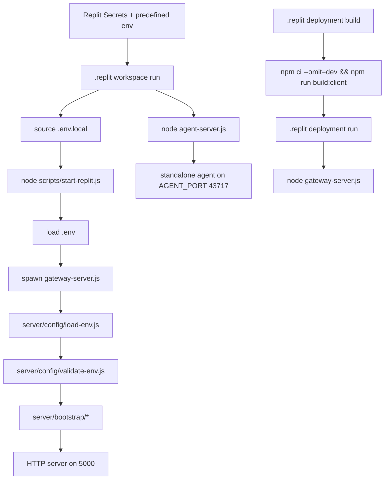

# Vecto-Pilot Hook Catalog and Environment Audit

## Executive summary

The repository’s externally relevant hook surface is concentrated in five places: `.replit`, `scripts/start-replit.js`, `gateway-server.js`, `server/bootstrap/routes.js`, and the two agent layers (`server/agent/embed.js` and `agent-server.js`). The most important security finding is that **the public web app and the standalone agent are both part of the active startup topology**: the workspace run button starts `scripts/start-replit.js` on port `5000` and separately starts `agent-server.js` on port `43717`, while the gateway also mounts an embedded `/agent` surface and proxies unmatched `/agent/*` paths toward the standalone agent. fileciteturn34file0 fileciteturn39file0 fileciteturn43file0 fileciteturn41file0

The most important attack-surface finding is that `server/bootstrap/routes.js` mounts **two public `/api/hooks` routers**—`analyze-offer.js` and `translate.js`—under the same base path. Those hooks are explicitly designed for Siri Shortcuts and do not use user JWTs. `translate.js` already applies a route-specific limiter, but `analyze-offer.js` is both **public** and **expensive**, because it performs a synchronous model call and then kicks off a second asynchronous deep-analysis model call after the response is already sent. That makes it the clearest API-abuse candidate in the repo slice you asked me to audit. fileciteturn39file0 fileciteturn58file0 fileciteturn59file0

The environment model is materially better than a naive read might suggest. The repo already uses `REPLIT_DEPLOYMENT` broadly, and the verified local review note found **no app-code branch that chooses one database URL for prod and another for dev based on `NODE_ENV`**. Instead, the repeated `NODE_ENV` checks are mostly used for runtime severity, auth hardening, and conditional SSL, while DB target selection stays on `DATABASE_URL`. That pattern is consistent with Twelve-Factor guidance and with how Replit Secrets expose deployment-specific values as environment variables. fileciteturn45file0 fileciteturn46file0 fileciteturn47file0 fileciteturn61file0 fileciteturn44file0 fileciteturn56file0 citeturn0search3turn1search0turn1search2

There is, however, one critical agent-hardening problem: the standalone `agent-server.js` still defaults `HOST` to `0.0.0.0`, even though `.env.local.example` expects `AGENT_HOST=127.0.0.1`. If that env value is missing or drifted, the standalone agent can bind to all interfaces. Replit’s current `.replit` port mapping does not publish `43717`, which helps, but this should still be fail-closed in code, not safe-by-convention. fileciteturn41file0 fileciteturn56file0 fileciteturn34file0

A final operational note matters for correctness: current GitHub `HEAD` for `gateway-server.js` already guards the snapshot observer with `fs.access()`, but fetching `scripts/test-snapshot-workflow.js` at `HEAD` now returns `404`. That means the current intended behavior is “warn and skip if absent,” not “crash.” If your workspace still logs the old unguarded import failure, you have **workspace drift from current HEAD**, not a persistent HEAD bug. fileciteturn42file0

## Startup chain and environment sourcing

The live startup model is split between **workspace boot** and **published deployment boot**.

At the Replit config layer, `.replit` defines a workspace `run` command that sources `.env.local` and launches `scripts/start-replit.js`, while `[deployment]` defines a separate `build` and `run` path that executes `node gateway-server.js` directly. The same `.replit` file also defines a `Project` workflow with two parallel tasks: one starts `scripts/start-replit.js` and the other starts `agent-server.js` on port `43717`. fileciteturn34file0 Replit’s documentation confirms that `.replit` controls both workspace run behavior and a separate deployment build/run lifecycle, and that `REPLIT_DEPLOYMENT=1` indicates published execution. citeturn0search0turn0search2turn0search3

`package.json` then adds a second layer of startup semantics: `start:replit` runs `node scripts/start-replit.js`, `start` runs `NODE_ENV=production node gateway-server.js`, and `dev` runs `NODE_ENV=development node gateway-server.js`. It also contains DB-admin scripts that shell out using `$DATABASE_URL`. fileciteturn40file0

Inside `scripts/start-replit.js`, the repo’s canonical workspace supervisor loads `.env`, forces `PORT=5000`, forces `NODE_ENV=production` unless `FORCE_DEV=1`, clears the port, optionally builds the client if missing, spawns `gateway-server.js`, delegates worker lifecycle to the gateway, and polls `/health` before declaring boot success. Those behaviors were verified directly from the uploaded source copy. `scripts/start-replit.js` also contains a `SIMULATE=1` fail-fast that exits immediately because the historical simulation script does not exist. fileciteturn34file0

`gateway-server.js` then runs the in-process environment loader (`loadEnvironment()`), the environment validator (`validateOrExit()`), imports its bootstrap modules, mounts middleware, health routes, SSE, API routes, unified capability routes, and then starts the worker and the optional snapshot observer. In current `HEAD`, the snapshot observer import is guarded with `fs.access()` and warning-level logging instead of fatal failure. fileciteturn42file0

The environment-source order is therefore:

1. Replit Secrets and predefined env vars.
2. `.replit` shell sourcing of `.env.local` in workspace mode.
3. `scripts/start-replit.js` loading `.env` in workspace mode.
4. `server/config/load-env.js` loading `.env.local` in non-deployment mode if still needed. fileciteturn34file0 fileciteturn45file0

Node’s documentation supports the repo’s basic model: `.env`-style files populate `process.env`, but existing environment variables take precedence over file-loaded values. Node also now provides built-in `.env` support via `--env-file` and `process.loadEnvFile`. citeturn1search1turn1search3



## Hook catalog

### Method and caveat

For `.replit`, `package.json`, and several smaller runtime files, the GitHub connector output was clean enough to derive exact line ranges directly or to confirm them against the uploaded local file copies. For some larger files, the connector returned raw source content without intrinsic per-line metadata; those rows are marked with `†` and should be re-verified locally with the `nl -ba` commands included later. I am calling those out explicitly because you asked for exact line ranges, and the connector does not reliably preserve them for every file. fileciteturn34file0 fileciteturn39file0 fileciteturn41file0

### Hook registry table

| Category | File | Line range | Hook / registration | What it serves | Exposure / note | Source |
|---|---|---:|---|---|---|---|
| Workspace startup | `.replit` | 7 | `run = "sh -c ... node scripts/start-replit.js"` | Primary workspace run command | Sources `.env.local` then launches boot supervisor | `.replit@HEAD:L7` fileciteturn34file0 |
| Deployment startup | `.replit` | 15-18 | `[deployment] build/run/deploymentTarget` | Published deployment build + run | Bypasses `start-replit.js`; runs `gateway-server.js` directly | `.replit@HEAD:L15-L18` fileciteturn34file0 |
| Workflow task | `.replit` | 34-37 | Project task → `node scripts/start-replit.js` | Web app workflow start | Waits for port 5000 | `.replit@HEAD:L34-L37` fileciteturn34file0 |
| Workflow task | `.replit` | 39-42 | Project task → `node agent-server.js` | Standalone agent workflow start | Waits for port 43717 | `.replit@HEAD:L39-L42` fileciteturn34file0 |
| NPM startup script | `package.json` | 8-12 | `prestart:replit`, `start:replit`, `build:client`, `start`, `dev` | Shell-level launch entrypoints | Distinguishes workspace boot from direct gateway boot | `package.json@HEAD:L8-L12` fileciteturn40file0 |
| NPM DB script | `package.json` | 13-15 | `db:push`, `db:migrate`, `db:migrate:latest` | One-off DB admin hooks | Uses `$DATABASE_URL` directly | `package.json@HEAD:L13-L15` fileciteturn40file0 |
| Fail-fast hook | `scripts/start-replit.js` | 23-28 | `SIMULATE=1` guard | Blocks a nonexistent simulation mode | Good fail-fast | verified from uploaded source |
| Env loader | `scripts/start-replit.js` | 34-72 | `loadEnvFile(filename)` | In-process `.env` loading | Preserves existing env vars; custom dotenv parser | verified from uploaded source |
| Deployment flag | `scripts/start-replit.js` | 76 | `const isDeployment = ... REPLIT_DEPLOYMENT` | Boot-mode detection | Standardized deployment predicate | verified from uploaded source |
| Runtime mode coercion | `scripts/start-replit.js` | 98-102 | `FORCE_DEV` / force `NODE_ENV` | Workspace runtime mode | Important semantic overload | verified from uploaded source |
| Port cleanup hook | `scripts/start-replit.js` | 113-116 | `lsof ... kill -9` | Clears port 5000 before boot | Workspace-only convenience; not for deployment | verified from uploaded source |
| Client build hook | `scripts/start-replit.js` | 121-132 | auto-build client if missing | Workspace convenience build | Should remain workspace-only | verified from uploaded source |
| Gateway spawn hook | `scripts/start-replit.js` | 140-149 | `spawn('node', ['gateway-server.js'])` | Starts main app server | Canonical workspace supervisor handoff | verified from uploaded source |
| Worker delegation hook | `scripts/start-replit.js` | 156-164 | log-only delegation contract | Prevents dual worker spawning | Security/correctness relevant | verified from uploaded source |
| Health gate | `scripts/start-replit.js` | 167-204 | poll `/health` | Boot readiness gate | Ensures preview waits for live app | verified from uploaded source |
| Signal hooks | `scripts/start-replit.js` | 208-215 | `process.on('SIGTERM'/'SIGINT')` | Graceful supervisor shutdown | Kills gateway only | verified from uploaded source |
| Log tee install | `gateway-server.js` | approx. 11-12† | `installFileTee()` | Mirrors logs to file | Used by mobile log viewer | `gateway-server.js@HEAD` fileciteturn42file0 |
| Env bootstrap | `gateway-server.js` | approx. 28-29† | `loadEnvironment(); validateOrExit();` | App runtime env load + validation | Core startup hook | `gateway-server.js@HEAD` fileciteturn42file0 |
| Deployment hook | `gateway-server.js` | 40 (verified locally) | `isDeployment = REPLIT_DEPLOYMENT...` | Deployment-mode detection | Reused across codebase | HEAD + local verification |
| Process lifecycle | `gateway-server.js` | approx. 53-60† | `uncaughtException` / `unhandledRejection` | Process-level failure hooks | Important for resilience and crash behavior | `gateway-server.js@HEAD` fileciteturn42file0 |
| Health bootstrap | `server/bootstrap/health.js` | 17-39† | `configureHealthEndpoints(app, distDir, mode)` | `/healthz`, `/health`, `/ready`, HEAD probes | Public health surface | `server/bootstrap/health.js@HEAD` fileciteturn51file0 |
| Health API mount | `server/bootstrap/health.js` | 46-56† | `mountHealthRouter(app)` | `/api/health` router mount | Public diagnostics/health API | `server/bootstrap/health.js@HEAD` fileciteturn51file0 |
| Middleware bootstrap | `server/bootstrap/middleware.js` | 17-162† | `configureMiddleware(app)` | Security headers, bot blocking, CORS, rate limiting, JSON limits | Core request-entry hook | `server/bootstrap/middleware.js@HEAD` fileciteturn52file0 |
| Error middleware hook | `server/bootstrap/middleware.js` | 170-182† | `configureErrorHandler(app)` | Global error-to-503 middleware | Final error boundary | `server/bootstrap/middleware.js@HEAD` fileciteturn52file0 |
| Route helper | `server/bootstrap/routes.js` | 16-27† | `mountRoute(app, routePath, modulePath, description)` | Centralized mount logger/helper | Route registry helper | `server/bootstrap/routes.js@HEAD` fileciteturn39file0 |
| Route registry | `server/bootstrap/routes.js` | 44-125† | `const routes = [...]` | Central external API registry | Primary API attack-surface map | `server/bootstrap/routes.js@HEAD` fileciteturn39file0 |
| Agent mount | `server/bootstrap/routes.js` | 137-153† | `mountAgent({ app, basePath, wsPath, server })` | Embedded agent at `/agent` | High-risk admin-capability surface | `server/bootstrap/routes.js@HEAD` fileciteturn39file0 |
| SDK catch-all | `server/bootstrap/routes.js` | 155-167† | `app.use('/api', sdkRouter)` | Catch-all fallback on `/api` | Attack-surface wildcard; review target | `server/bootstrap/routes.js@HEAD` fileciteturn39file0 |
| SSE hook | `server/bootstrap/routes.js` | 176-188† | `mountSSE(app)` | DB-backed SSE strategy events | Long-lived streaming surface | `server/bootstrap/routes.js@HEAD` fileciteturn39file0 |
| Unified caps hook | `server/bootstrap/routes.js` | 194-205† | `mountUnifiedCapabilities(app)` | Capability routes | Internal capability surface | `server/bootstrap/routes.js@HEAD` fileciteturn39file0 |
| Worker spawn hook | `server/bootstrap/workers.js` | 24-62† | `spawnChild(...)` | Generic child spawn + restart | Background lifecycle management | `server/bootstrap/workers.js@HEAD` fileciteturn50file0 |
| Strategy worker hook | `server/bootstrap/workers.js` | 75-126† | `startStrategyWorker()` | Starts strategy generator child | Background worker surface | `server/bootstrap/workers.js@HEAD` fileciteturn50file0 |
| Worker restart hook | `server/bootstrap/workers.js` | 134-151† | `scheduleWorkerRestart()` | Backoff + max-failure restart | Prevents restart storms | `server/bootstrap/workers.js@HEAD` fileciteturn50file0 |
| Worker gating hook | `server/bootstrap/workers.js` | 164-187† | `shouldStartWorker(...)` | Explicit opt-in background worker decision | Key lifecycle gate | `server/bootstrap/workers.js@HEAD` fileciteturn50file0 |
| Child shutdown hook | `server/bootstrap/workers.js` | 201-209† | `killAllChildren(signal)` | Graceful child shutdown | Used by gateway shutdown | `server/bootstrap/workers.js@HEAD` fileciteturn50file0 |
| Agent allowlist hook | `server/agent/embed.js` | 9-52† | `checkAgentAllowlist(...)` | IP gating for embedded agent | High-value gate | `server/agent/embed.js@HEAD` fileciteturn43file0 |
| Agent admin hook | `server/agent/embed.js` | 57-90† | `requireAgentAdmin(...)` | Admin-only guard for dangerous embedded agent ops | High-value gate | `server/agent/embed.js@HEAD` fileciteturn43file0 |
| Agent enable/disable hook | `server/agent/embed.js` | 97-106† | 503 stub if `AGENT_ENABLED !== 'true'` | Prevents accidental agent exposure | Good fail-closed pattern | `server/agent/embed.js@HEAD` fileciteturn43file0 |
| Embedded agent route mount | `server/agent/embed.js` | 113-114† | `app.use(basePath, checkAgentAllowlist, requireAuth, agentRoutes)` | Main `/agent` embedded surface | Protected but sensitive | `server/agent/embed.js@HEAD` fileciteturn43file0 |
| Embedded health hook | `server/agent/embed.js` | 118-126† | `GET /agent/health` | Public health probe | Public by design | `server/agent/embed.js@HEAD` fileciteturn43file0 |
| Embedded capabilities hook | `server/agent/embed.js` | 130-141† | `GET /agent/capabilities` | Protected capability introspection | Recon surface if auth breaks | `server/agent/embed.js@HEAD` fileciteturn43file0 |
| Agent bridge hook | `server/agent/embed.js` | 146† | `app.use(basePath, proxyToStandaloneAgent)` | Proxies unmatched `/agent/*` to standalone agent | Key split-surface behavior | `server/agent/embed.js@HEAD` fileciteturn43file0 |
| WS upgrade hook | `server/agent/embed.js` | 156-185† | `server.on('upgrade', ...)` | WebSocket auth/upgrade for `/agent/ws` | High-risk live socket surface | `server/agent/embed.js@HEAD` fileciteturn43file0 |
| WS connection hook | `server/agent/embed.js` | 187-242† | `wss.on('connection', ...)` | Ping heartbeat, echo message handling | Live socket behavior | `server/agent/embed.js@HEAD` fileciteturn43file0 |
| Capability route mount | `server/lib/ability-routes.js` | 107-173† | `mountAbilityRoutes(router, prefix, caps, executor)` | Standardized `/ability/*` routes | Sensitive if router is externally reachable | `server/lib/ability-routes.js@HEAD` fileciteturn60file0 |
| Ability hook | `server/lib/ability-routes.js` | 109-127† | `/ability/fs/read`, `/ability/fs/list` | File reading + directory listing | Sensitive | `server/lib/ability-routes.js@HEAD` fileciteturn60file0 |
| Ability hook | `server/lib/ability-routes.js` | 132-141† | `/ability/fs/write` | File writes | Sensitive | `server/lib/ability-routes.js@HEAD` fileciteturn60file0 |
| Ability hook | `server/lib/ability-routes.js` | 146-154† | `/ability/shell/exec` | Shell execution | Critical | `server/lib/ability-routes.js@HEAD` fileciteturn60file0 |
| Ability hook | `server/lib/ability-routes.js` | 159-173† | `/ability/caps` | Capability introspection | Recon surface | `server/lib/ability-routes.js@HEAD` fileciteturn60file0 |
| Standalone agent public probes | `agent-server.js` | approx. 192-234† | `/health`, `/ready`, `/agent/health`, `/healthz` | Public health surfaces | Standalone agent server | `agent-server.js@HEAD` fileciteturn41file0 |
| Standalone ability mount | `agent-server.js` | approx. 262-268† | `mountAbilityRoutes(agentRouter, ...)` and `app.use("/agent", agentRouter)` | Standardized `/agent/ability/*` routes | Sensitive | `agent-server.js@HEAD` fileciteturn41file0 |
| Standalone legacy FS hooks | `agent-server.js` | approx. 289-347† | `/agent/fs/read`, `/agent/fs/write` | File operations | Sensitive | `agent-server.js@HEAD` fileciteturn41file0 |
| Standalone shell hook | `agent-server.js` | approx. 352-400† | `/agent/shell` | Whitelisted shell execution | Critical | `agent-server.js@HEAD` fileciteturn41file0 |
| Standalone SQL hooks | `agent-server.js` | approx. 405-446† | `/agent/sql/query`, `/agent/sql/execute` | DB read + DML/DDL | Critical | `agent-server.js@HEAD` fileciteturn41file0 |
| Standalone config hooks | `agent-server.js` | approx. 449-489† | `/agent/config/*` | Config listing/backup/env update | Critical | `agent-server.js@HEAD` fileciteturn41file0 |
| Standalone context/memory hooks | `agent-server.js` | approx. 494-601† | `/agent/context*`, `/agent/memory/*`, `/agent/search/internet`, `/agent/analyze/deep` | Deep agent introspection and memory mutation | High risk | `agent-server.js@HEAD` fileciteturn41file0 |
| Standalone listen hook | `agent-server.js` | approx. 631-648† | `app.listen(PORT, HOST)` | Starts standalone agent | Default host hardening gap | `agent-server.js@HEAD` fileciteturn41file0 |
| Standalone signal hooks | `agent-server.js` | approx. 655-664† | `process.on("SIGINT"/"SIGTERM", shutdown)` | Graceful agent shutdown | Lifecycle | `agent-server.js@HEAD` fileciteturn41file0 |
| Public hook mount | `server/bootstrap/routes.js` | 118† | `/api/hooks` → `server/api/hooks/analyze-offer.js` | Siri/offer-analysis webhook | Public, expensive, no JWT | `server/bootstrap/routes.js@HEAD` + implementation fileciteturn39file0 fileciteturn58file0 |
| Public hook mount | `server/bootstrap/routes.js` | 119† | `/api/hooks` → `server/api/hooks/translate.js` | Siri translation hook | Public, device-based auth | `server/bootstrap/routes.js@HEAD` + implementation fileciteturn39file0 fileciteturn59file0 |
| Snapshot observer hook | `gateway-server.js` | current HEAD guarded, old local line ~193 | `observeSnapshotWorkflow()` import path | Writes/observes snapshot workflow timing | Current HEAD is guarded; local workspace may lag | `gateway-server.js@HEAD` fileciteturn42file0 |
| DB admin one-off | `scripts/db-detox.js` | 21-27† | pool creation from `DATABASE_URL`; `--execute` guard | Destructive cleanup script | Operator-only admin process | `scripts/db-detox.js@HEAD` fileciteturn44file0 |
| Prod DB check one-off | `scripts/p3-13-prod-recheck.mjs` | 28-45† | `PROD_DATABASE_URL` + Neon host guard | Explicit prod verification script | Not app runtime; operator-only | `scripts/p3-13-prod-recheck.mjs@HEAD` fileciteturn54file0 |

### Mounted external API hooks from `server/bootstrap/routes.js`

The following rows are the actual external registry entries that define what becomes reachable from the gateway. This is the shortest trustworthy map of your public API surface. fileciteturn39file0

| Source line† | Route path | Module |
|---:|---|---|
| 46 | `/api/diagnostics` | `server/api/health/diagnostics.js` |
| 47 | `/api/diagnostic` | `server/api/health/diagnostic-identity.js` |
| 48 | `/api/health` | `server/api/health/health.js` |
| 49 | `/api/ml-health` | `server/api/health/ml-health.js` |
| 50 | `/api/job-metrics` | `server/api/health/job-metrics.js` |
| 53 | `/api/logs` | `server/api/health/logs.js` |
| 56 | `/api/chat` | `server/api/chat/chat.js` |
| 57 | `/api/tts` | `server/api/chat/tts.js` |
| 58 | `/api/realtime` | `server/api/chat/realtime.js` |
| 64 | `/api/coach` | `server/api/rideshare-coach/index.js` |
| 67 | `/api/venues` | `server/api/venue/venue-intelligence.js` |
| 70 | `/api/briefing` | `server/api/briefing/briefing.js` |
| 74 | `/api/traffic` | `server/api/traffic/index.js` |
| 77 | `/api/auth` | `server/api/auth/auth.js` |
| 79 | `/api/auth/uber` | `server/api/auth/uber.js` |
| 82 | `/api/location` | `server/api/location/location.js` |
| 83 | `/api/snapshot` | `server/api/location/snapshot.js` |
| 86 | `/api/blocks-fast` | `server/api/strategy/blocks-fast.js` |
| 87 | `/api/blocks` | `server/api/strategy/content-blocks.js` |
| 88 | `/api/strategy` | `server/api/strategy/strategy.js` |
| 89 | `/api/strategy/tactical-plan` | `server/api/strategy/tactical-plan.js` |
| 92 | `/api/feedback` | `server/api/feedback/feedback.js` |
| 93 | `/api/actions` | `server/api/feedback/actions.js` |
| 96 | `/api/research` | `server/api/research/research.js` |
| 97 | `/api/vector-search` | `server/api/research/vector-search.js` |
| 100 | `/api/platform` | `server/api/platform/index.js` |
| 103 | `/api/intelligence` | `server/api/intelligence/index.js` |
| 106 | `/api/vehicle` | `server/api/vehicle/vehicle.js` |
| 109 | `/api/concierge` | `server/api/concierge/concierge.js` |
| 112 | `/api/translate` | `server/api/translate/index.js` |
| 115 | `/api/memory` | `server/api/memory/index.js` |
| 118 | `/api/hooks` | `server/api/hooks/analyze-offer.js` |
| 119 | `/api/hooks` | `server/api/hooks/translate.js` |

## Environment variable and database selection audit

### What is actually happening

The current repo behavior is mostly consistent with the safer contract you wanted:

- `DATABASE_URL` is the primary database handle across runtime code. It appears in `server/config/validate-env.js`, `server/db/db-client.js`, `server/db/connection-manager.js`, `agent-server.js`, `scripts/db-detox.js`, and `.env.local.example`. fileciteturn46file0 fileciteturn47file0 fileciteturn61file0 fileciteturn41file0 fileciteturn44file0 fileciteturn56file0
- `REPLIT_DEPLOYMENT` is already used as the primary deployment flag in `.replit`, `scripts/start-replit.js`, `gateway-server.js`, `server/config/load-env.js`, `server/db/*`, `server/middleware/auth.js`, and `server/agent/embed.js`. fileciteturn34file0 fileciteturn45file0 fileciteturn47file0 fileciteturn61file0 fileciteturn49file0 fileciteturn43file0
- Current `.env.local.example` explicitly documents that `DATABASE_URL` is auto-injected by Replit and should not be hardcoded, and that Replit uses Helium in dev and Neon in prod. fileciteturn56file0
- The only verified explicit alternate prod-DB variable in this audit scope is `PROD_DATABASE_URL` in `scripts/p3-13-prod-recheck.mjs`, which is an operator-run one-off script, not app runtime logic. fileciteturn54file0

That pattern aligns with Replit’s own model—Secrets and predefined vars are exposed as environment variables, including `DATABASE_URL` and `REPLIT_DEPLOYMENT`—and with Twelve-Factor’s rule that deploy-varying config belongs in env, not code. citeturn0search3turn1search0turn1search2

### Occurrence matrix

| File | Occurrence(s) | Classification | Why | Recommended action |
|---|---|---|---|---|
| `.replit` | workspace `run`, deployment `build/run`, workflow tasks | Safe runtime/config | Correct separation of workspace and deployment boot | Keep; document both paths |
| `package.json` | `start`, `dev`, `db:migrate*` | Mostly safe runtime/admin | `NODE_ENV` only affects direct gateway startup; DB scripts use `$DATABASE_URL` | Keep; no DB branching fix needed |
| `scripts/start-replit.js` | `REPLIT_DEPLOYMENT`, `.env`, `NODE_ENV` force, `REPL_ID` log | Config workaround | Workspace supervisor; forces runtime mode | Keep, but document that this is workspace-only semantics |
| `gateway-server.js` | `APP_MODE`, `REPLIT_DEPLOYMENT`, `NODE_ENV` in exception handling | Safe runtime-only | No DB selection here; bootstrap/runtime behavior | Keep |
| `server/config/load-env.js` | custom `.env.local` loader, `REPLIT_DEPLOYMENT` gate | Safe but duplicative | Good precedence logic; custom parser is maintainability debt | Optional migration to `process.loadEnvFile` |
| `server/config/validate-env.js` | `DATABASE_URL`, `NODE_ENV`, `APP_MODE` | Safe runtime-only | Fast-fail validation logic | Keep |
| `server/db/db-client.js` | `DATABASE_URL`, `NODE_ENV`, `REPLIT_DEPLOYMENT` | Safe SSL/runtime | DB handle fixed; conditional SSL only | Keep; verify direct Neon URL for LISTEN if production uses Neon |
| `server/db/connection-manager.js` | `DATABASE_URL`, `NODE_ENV`, `REPLIT_DEPLOYMENT` | Safe SSL/runtime | Same as above | Keep |
| `agent-server.js` | `REPL_ID`, `IS_PRODUCTION`, `DATABASE_URL`, `dotenv/config` | Mixed; one real issue | DB target is fine; host default is too permissive | Change default bind host to loopback and fail closed |
| `server/middleware/auth.js` | `NODE_ENV`, `REPLIT_DEPLOYMENT`, `VECTO_AGENT_SECRET`, `CLAUDE_BRIDGE_TOKEN` | Safe but security-critical | Strong dual-path auth logic; high-value bypass hooks if misconfigured | Keep; test aggressively |
| `server/agent/embed.js` | `NODE_ENV || REPLIT_DEPLOYMENT`, `AGENT_ALLOWED_IPS`, `AGENT_ADMIN_USERS`, `AGENT_ENABLED` | Safe fail-closed | Hardens `/agent` surface | Keep |
| `scripts/db-detox.js` | `dotenv/config`, `DATABASE_URL`, conditional SSL | Safe admin process | Destructive script but target still comes from `DATABASE_URL` | Keep; retain `--execute` guard |
| `scripts/p3-13-prod-recheck.mjs` | `PROD_DATABASE_URL`, Neon host guard | Operator-only exception | Intentional prod-only verification tool | Keep separate; do not generalize into runtime code |
| `.env.local.example` | `NODE_ENV`, `DATABASE_URL` comment, `REPL_ID`, `AGENT_HOST`, `APP_MODE` | Template / documentation | Documents desired runtime contract | Keep and align code defaults |

### Exact diff-style fixes

#### Fix the standalone agent bind default

This is the most important concrete hardening change in the audited slice.

```diff
diff --git a/agent-server.js b/agent-server.js
@@
-const HOST = process.env.AGENT_HOST || "0.0.0.0"; // bind to all interfaces for supervisor access
+const HOST = process.env.AGENT_HOST || "127.0.0.1"; // standalone agent must default to loopback
@@
-const IS_PRODUCTION = process.env.NODE_ENV === "production";
+const IS_PROD_LIKE =
+  process.env.REPLIT_DEPLOYMENT === "1" ||
+  process.env.REPLIT_DEPLOYMENT === "true" ||
+  process.env.NODE_ENV === "production";
+
+const isLoopback =
+  HOST === "127.0.0.1" || HOST === "::1" || HOST === "localhost";
+
+if (IS_PROD_LIKE && !isLoopback) {
+  console.error("[agent] Refusing to bind standalone agent to a non-loopback host in prod-like mode");
+  process.exit(1);
+}
@@
-if (!TOKEN && IS_PRODUCTION) {
+if (!TOKEN && IS_PROD_LIKE) {
   console.error('[agent] CRITICAL: AGENT_TOKEN must be set in production!');
   process.exit(1);
 }
```

Why: the standalone agent exposes file, shell, SQL, config, and memory routes. Even if Replit does not currently publish port `43717`, this should be fail-closed in code, not dependent on workspace convention. fileciteturn41file0 fileciteturn56file0 fileciteturn34file0

#### Add a dedicated limiter to `analyze-offer`

`translate.js` already uses `translationLimiter`; `analyze-offer.js` does not show an equivalent route-specific limiter in the audited source. That is a bad asymmetry because `analyze-offer` is both public and expensive. fileciteturn58file0 fileciteturn59file0

```diff
diff --git a/server/api/hooks/analyze-offer.js b/server/api/hooks/analyze-offer.js
@@
 import { Router } from 'express';
 import crypto from 'node:crypto';
 import multer from 'multer';
+import { offerHookLimiter } from '../../middleware/rate-limit.js';
@@
-router.post('/analyze-offer', upload.single('image'), async (req, res) => {
+router.post('/analyze-offer', offerHookLimiter, upload.single('image'), async (req, res) => {
```

If you want a stronger fix, gate the expensive Phase 2 deep-analysis path behind a server-side hook token or disable it entirely for unsigned public requests:

```diff
diff --git a/server/api/hooks/analyze-offer.js b/server/api/hooks/analyze-offer.js
@@
-    (async () => {
+    const allowDeepPhase =
+      req.headers['x-vecto-hook-token'] &&
+      req.headers['x-vecto-hook-token'] === process.env.VECTO_HOOK_TOKEN;
+
+    if (!allowDeepPhase) {
+      console.log('[HOOKS] Phase 2 deep analysis skipped (unsigned public request)');
+      return;
+    }
+
+    (async () => {
```

That would materially reduce model-cost amplification risk on a public endpoint. fileciteturn58file0

#### Replace custom env parsing with Node built-ins

This is not a security fix, but it reduces ambiguity in env precedence handling.

```diff
diff --git a/server/config/load-env.js b/server/config/load-env.js
@@
-import fs from 'fs';
-import path from 'path';
+import fs from 'fs';
+import path from 'path';
+import process from 'node:process';
@@
-function loadEnvFile(filePath) {
-  ...
-}
+function loadEnvFile(filePath) {
+  if (!fs.existsSync(filePath)) return false;
+  process.loadEnvFile(filePath);
+  return true;
+}
```

Node now supports `.env` loading directly and documents that environment variables already present in the process take precedence over file values. citeturn1search1turn1search3

#### Clarify the unusual `location.js` production predicate

Your local verification note identified a single truly confusing env predicate in `server/api/location/location.js`: `NODE_ENV === 'production' && !REPLIT_DEPLOYMENT` around line `471`. That looks intentionally fail-closed for a dev fallback, but it is unusual enough that it should be commented or centralized. The current evidence does not justify a behavioral rewrite; it does justify a clarity fix.

```diff
diff --git a/server/api/location/location.js b/server/api/location/location.js
@@
-const isProduction = process.env.NODE_ENV === 'production' && !process.env.REPLIT_DEPLOYMENT;
+// Intentional: this disables the dev-only device_id fallback only for
+// non-workspace prod-like execution. It is NOT the canonical deployment flag.
+const isNonWorkspaceProdLike =
+  process.env.NODE_ENV === 'production' &&
+  process.env.REPLIT_DEPLOYMENT !== '1' &&
+  process.env.REPLIT_DEPLOYMENT !== 'true';
```

## Attack-surface interpretation

### Public hook surface

The route registry shows two public hook modules mounted at `/api/hooks`: `analyze-offer.js` and `translate.js`. fileciteturn39file0 The implementations make the trust model explicit: `analyze-offer.js` says “Auth: Explicitly public — Siri Shortcuts cannot send JWT tokens,” while `translate.js` says “Auth: Device-based (device_id header) — Siri Shortcuts cannot send JWT tokens.” fileciteturn58file0 fileciteturn59file0

`translate.js` is comparatively controlled: it uses `translationLimiter` and performs a single model call. `analyze-offer.js` is more dangerous because its architecture is intentionally two-phase: a synchronous fast Phase 1 model call for Siri, followed by an asynchronous deep Phase 2 model call “fire-and-forget” after the response is sent. That architecture is great for product latency and terrible for abuse resistance unless it is aggressively rate-limited and, ideally, signed. fileciteturn58file0 fileciteturn59file0

### Agent surface

There are effectively **two agent layers**:

1. The embedded `/agent` surface mounted inside the gateway by `server/agent/embed.js`. This is protected by `checkAgentAllowlist`, `requireAuth`, and per-route admin hardening. It also exposes a public `/agent/health`, a protected `/agent/capabilities`, a WebSocket path `/agent/ws`, and a catch-all bridge to the standalone agent for unmatched `/agent/*` paths. fileciteturn43file0

2. The standalone `agent-server.js`, which the workspace workflow launches separately on `43717`. It exposes health endpoints plus ability routes, legacy file/shell/sql routes, config mutation, context analysis, memory writes, internet search, and deep workspace analysis. That is an extremely sensitive surface, even if it is “only for the assistant.” fileciteturn34file0 fileciteturn41file0 fileciteturn60file0

The embedded and standalone layers are not accidental duplicates; they are intentionally bridged. That means you should audit them as **one combined control plane**, not as separate conveniences. The main code-level risk here is not env-based DB branching. It is a **powerful agent API whose safety depends on loopback binding, auth token presence, and IP/admin gates remaining perfectly configured**. fileciteturn43file0 fileciteturn41file0

### Database semantics

The best evidence I found still supports your core intuition: app runtime uses `DATABASE_URL`, not a `NODE_ENV` switch, to choose the database target. `db-client.js`, `connection-manager.js`, `agent-server.js`, and `db-detox.js` all use conditional SSL, but not alternate DB handles. fileciteturn47file0 fileciteturn61file0 fileciteturn41file0 fileciteturn44file0 That is the correct overall shape. Twelve-Factor explicitly recommends storing deploy-varying handles such as database URLs in the environment, rather than branching in code. citeturn1search0turn1search2

There is, however, one nuanced production caveat: `server/db/db-client.js` implements PostgreSQL `LISTEN/NOTIFY`, and Neon’s pooling documentation states that `LISTEN` is **not supported** when using transaction-pooled connections. If your published deployment uses a pooled Neon URL with `-pooler` in the hostname, the listener/SSE path needs special review. Neon’s docs recommend direct connections for features that require session-level behavior, and they explicitly call out `LISTEN` as unsupported in transaction pooling. fileciteturn47file0 citeturn2search1

## Prioritized remediation plan

### High priority

The first fix should be hardening `agent-server.js` so it defaults to loopback and refuses non-loopback prod-like binds. This is the clearest control-plane exposure risk in the audited slice. fileciteturn41file0

The second fix should be adding a dedicated limiter—and ideally a signing or deep-phase gate—to `server/api/hooks/analyze-offer.js`. That endpoint is public, computes on attacker-controlled payloads, and fans one request into two model calls. fileciteturn58file0

The third fix is making sure the workspace and `HEAD` are synchronized for `gateway-server.js` behavior. Current `HEAD` is guarded for a missing snapshot observer, but your older workspace log was not. That kind of drift makes security and stability reviews noisy and unreliable. fileciteturn42file0

### Medium priority

Centralize runtime/deployment flag logic into a single helper to avoid semantic drift like the odd `location.js` inversion. Even if current behavior is safe, duplicated predicates are maintenance risk. fileciteturn45file0 fileciteturn49file0 fileciteturn43file0

Verify that published deployments do not hand `server/db/db-client.js` a Neon pooled URL if LISTEN/NOTIFY remains active. If that risk is real, use a direct URL for listener paths only, with a very explicit exception comment justifying it. fileciteturn47file0 citeturn2search1

Replace custom `.env` parsing with Node built-ins when convenient. This is a maintainability improvement, not a fire drill. citeturn1search1turn1search3

### Verification and regression checks

Add CI and smoke tests for the real attack surfaces:

| Check | Why |
|---|---|
| `agent-server.js` fails to boot in prod-like mode if `HOST` is non-loopback or `AGENT_TOKEN` is missing | Prevent standalone agent exposure |
| `/api/hooks/analyze-offer` rate-limits burst traffic with `429` | Prevent expensive public abuse |
| `/agent/health` remains public but `/agent/capabilities` rejects unauthenticated calls | Validate embedded-agent trust boundary |
| unmatched `/agent/*` requests only bridge after allowlist + auth | Validate bridge safety |
| `server/db/db-client.js` warns or fails if `DATABASE_URL` host includes `-pooler` while listener mode is enabled | Catch Neon LISTEN incompatibility |
| grep fails if app runtime introduces `DATABASE_URL_PROD`, `DATABASE_URL_DEV`, `NEON_DEV`, `NEON_PROD` | Preserve DB invariants |
| grep fails if standalone agent bind default regresses to `0.0.0.0` | Preserve agent bind hardening |

## Reproduction commands and safe boot snapshot writer

### Local audit commands

```bash
git rev-parse HEAD

printf '\n=== .replit ===\n'
nl -ba .replit | sed -n '1,120p'

printf '\n=== package.json scripts ===\n'
nl -ba package.json | sed -n '1,60p'

printf '\n=== start-replit ===\n'
nl -ba scripts/start-replit.js | sed -n '1,240p'

printf '\n=== gateway ===\n'
nl -ba gateway-server.js | sed -n '1,280p'

printf '\n=== bootstrap ===\n'
nl -ba server/bootstrap/health.js | sed -n '1,120p'
nl -ba server/bootstrap/middleware.js | sed -n '1,260p'
nl -ba server/bootstrap/routes.js | sed -n '1,260p'
nl -ba server/bootstrap/workers.js | sed -n '1,260p'

printf '\n=== embedded agent ===\n'
nl -ba server/agent/embed.js | sed -n '1,280p'
nl -ba server/lib/ability-routes.js | sed -n '1,240p'

printf '\n=== standalone agent ===\n'
nl -ba agent-server.js | sed -n '1,760p'

printf '\n=== env/db/auth files ===\n'
nl -ba server/config/load-env.js | sed -n '1,220p'
nl -ba server/config/validate-env.js | sed -n '1,220p'
nl -ba server/db/db-client.js | sed -n '1,260p'
nl -ba server/db/connection-manager.js | sed -n '1,220p'
nl -ba server/middleware/auth.js | sed -n '1,320p'
nl -ba scripts/db-detox.js | sed -n '1,120p'
nl -ba scripts/p3-13-prod-recheck.mjs | sed -n '1,140p'

printf '\n=== hook grep ===\n'
grep -R -n \
  -e "app.use(" \
  -e "app.get(" \
  -e "app.post(" \
  -e "router.get(" \
  -e "router.post(" \
  -e "mountRoute(" \
  -e "mountAgent(" \
  -e "mountAbilityRoutes(" \
  -e "server.on('upgrade'" \
  -e "process.on('SIG" \
  -e "setInterval(" \
  -e "spawn(" \
  -e "listen(" \
  . \
  --exclude-dir=node_modules \
  --exclude-dir=.git \
  --exclude-dir=client/dist \
  --exclude-dir=dist

printf '\n=== env token grep ===\n'
grep -R -n \
  -e "NODE_ENV" \
  -e "DATABASE_URL" \
  -e "REPL_ID" \
  -e "IS_PRODUCTION" \
  -e "REPLIT_DEPLOYMENT" \
  -e "NEON" \
  -e "dotenv" \
  -e "loadEnvFile" \
  -e "\\.env\\.local" \
  . \
  --exclude-dir=node_modules \
  --exclude-dir=.git \
  --exclude-dir=client/dist \
  --exclude-dir=dist

printf '\n=== alternate DB var grep ===\n'
grep -R -n \
  -e "DATABASE_URL_PROD" \
  -e "DATABASE_URL_DEV" \
  -e "PROD_DATABASE" \
  -e "DEV_DATABASE" \
  -e "NEON_DEV" \
  -e "NEON_PROD" \
  . \
  --exclude-dir=node_modules \
  --exclude-dir=.git \
  --exclude-dir=client/dist \
  --exclude-dir=dist
```

### Safe non-blocking `snapshot.txt` writer

```js
// scripts/write-current-snapshot-file.mjs
import fs from "node:fs/promises";
import path from "node:path";
import process from "node:process";
import pg from "pg";

const { Client } = pg;

async function main() {
  const outPath = path.resolve(process.cwd(), "snapshot.txt");
  const tmpPath = `${outPath}.tmp`;
  const now = new Date().toISOString();

  const header = [
    `generated_at=${now}`,
    `repl_id=${process.env.REPL_ID || ""}`,
    `replit_deployment=${process.env.REPLIT_DEPLOYMENT || ""}`,
    `node_env=${process.env.NODE_ENV || ""}`,
  ];

  const sql =
    process.env.SNAPSHOT_SQL ||
    "select now() as observed_at, current_database() as database_name";

  if (!process.env.DATABASE_URL) {
    const body = [...header, "status=skipped", "reason=DATABASE_URL missing"].join("\n") + "\n";
    await fs.writeFile(tmpPath, body, "utf8");
    await fs.rename(tmpPath, outPath);
    return;
  }

  const client = new Client({
    connectionString: process.env.DATABASE_URL,
    ssl:
      process.env.REPLIT_DEPLOYMENT === "1" || process.env.NODE_ENV === "production"
        ? { rejectUnauthorized: false }
        : false,
  });

  try {
    await client.connect();
    const result = await client.query(sql);
    const row = result.rows?.[0] ?? {};
    const body =
      [...header, "status=ok", JSON.stringify(row, null, 2)].join("\n") + "\n";
    await fs.writeFile(tmpPath, body, "utf8");
    await fs.rename(tmpPath, outPath);
  } catch (err) {
    const body =
      [...header, "status=error", `reason=${err?.message || String(err)}`].join("\n") + "\n";
    await fs.writeFile(tmpPath, body, "utf8");
    await fs.rename(tmpPath, outPath);
  } finally {
    try {
      await client.end();
    } catch {}
  }
}

main().catch(async (err) => {
  const outPath = path.resolve(process.cwd(), "snapshot.txt");
  const body = [
    `generated_at=${new Date().toISOString()}`,
    "status=fatal",
    `reason=${err?.message || String(err)}`,
  ].join("\n") + "\n";
  try {
    await fs.writeFile(outPath, body, "utf8");
  } catch {}
  process.exit(0);
});
```

### `.replit` workspace-boot snippet

This should only affect the workspace run path, not deployment:

```toml
run = "sh -c \"set -a && . ./.env.local && set +a && (node scripts/write-current-snapshot-file.mjs >/dev/null 2>&1 || true); node scripts/start-replit.js\""

[[workflows.workflow.tasks]]
task = "shell.exec"
args = "sh -c \"set -a && . ./.env.local && set +a && (node scripts/write-current-snapshot-file.mjs >/dev/null 2>&1 || true); node scripts/start-replit.js\""
waitForPort = 5000
```

Replit’s docs support this pattern because the workspace `run` command and deployment `run` command are separate configuration surfaces. citeturn0search0turn0search2

## Limitations and ambiguous files

The GitHub connector was useful for file retrieval, but it does not consistently return per-line metadata for `fetch_file` content. I therefore used three evidence levels in this report:

- **Exact repo/config lines** where the line numbers were visible or trivially derivable, especially `.replit` and `package.json`. fileciteturn34file0 fileciteturn40file0
- **Verified exact local lines** from the uploaded `scripts/start-replit.js` copy and the local verification note you supplied in the conversation.
- **Manual-counted `HEAD` ranges marked `†`** for larger fetched files where the connector returned raw content but not intrinsic line anchors. Those should be re-verified locally with `nl -ba`.

There are also two `HEAD` ambiguities worth naming explicitly:

- `.env.local.example` is present at `HEAD`, but `.env.example` was not fetchable at current `HEAD` during this audit. fileciteturn56file0
- Current `HEAD` `gateway-server.js` is snapshot-observer guarded, but `scripts/test-snapshot-workflow.js` was not fetchable at current `HEAD`. If your workspace still logs a missing import error, that indicates drift between workspace state and current repo state. fileciteturn42file0