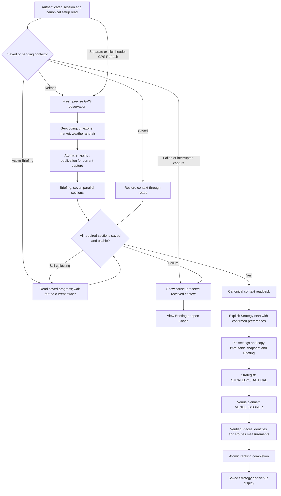

# MAIN and independent pipeline trace

Source review: September 29, 2026, `main` based on `6e98390697dfd3d677702bc64fe206b2383f5279` plus the working-tree changes recorded in the [review register](audits/PIPELINE_REVIEW_2026-09-29.md). This describes source behavior, not proof of deployment or live provider success. Read the register for verification and remaining limits.

Entry-sequence correction: Codex/Astra, September 30, 2026, checked the current location provider, portal capture, header refresh and admission sources. Location and Briefing prepare before preference confirmation; Strategy starts only through explicit admission of that prepared context.

Melody's purpose is to reduce the attention needed to evaluate work while driving. Saved preferences must remain usable without forcing edits. Missing measurements and failed sources must remain distinguishable from measured zero, verified absence, or a recommendation. Offer Analyzer calculations and spoken decisions have their own [full trace](OFFER_ANALYZER.md); they are not a new input to MAIN.

## Ordered waterfall

SSE wakes readers to fetch saved state; receiving an event never proves that this sequence completed. Active collection uses saved reads and a three-minute inactivity wait extended by saved progress, not a three-minute whole-pipeline deadline. The existing header GPS Refresh is a separate explicit new-context action, not a Refresh Briefing feature. There is no second active STRATEGY_CORE stage. Model names, role parameters and provider fallbacks belong to [model-registry.js](../../server/lib/ai/model-registry.js) and the [adapter guide](AI_MODEL_ADAPTERS.md), not copied pins in this guide.

### 1. Session and preference review

- [auth-context.tsx](../../client/src/contexts/auth-context.tsx) owns authenticated identity and cross-tab token changes. New identity clears account caches and subscriptions before loading the profile. [session-policy.js](../../server/lib/auth/session-policy.js), [auth middleware](../../server/middleware/auth.js), and [auth routes](../../server/api/auth/auth.js) enforce stored session lifetime and credential changes.
- [run-setup-context.tsx](../../client/src/contexts/run-setup-context.tsx) loads canonical setup and saved same-session context. [RunSetupSummary.tsx](../../client/src/components/co-pilot/RunSetupSummary.tsx) offers preference confirmation or editing; [SettingsPage.tsx](../../client/src/pages/co-pilot/SettingsPage.tsx) saves edits. Confirmation holds/releases new Strategy, while location and Briefing prepare independently. Saving or confirming preferences does not itself start Strategy.
- [main-runs.js](../../server/api/strategy/main-runs.js) exposes setup and explicit Continue. When Strategy starts, [main-run-admission.js](../../server/lib/main-run-admission.js) locks the current driver/session, reads canonical profile, one active primary vehicle and a valid ruleset, and verifies expected settings revision, rules version/hash, current run, prepared snapshot and request identity.
- The admitted row pins relevant profile/service/vehicle fields and effective rules into `main_run_admissions.configuration`, plus the prepared snapshot/Briefing source receipt; `users.current_main_run_id` selects the active intent. Repeated request identities replay their original receipt; changed settings, source identity or a different current run conflict. A canceled client request cannot make a late response the current client run.
- If an admission response is lost, its retry keeps the original request ID and complete expected-revision/run/snapshot body, even when canonical readback reveals the admitted snapshot clone. An edit or changed configuration/source abandons that retry; success consumes it so a later explicit Refresh creates a new intent. A replay with `current:false` reopens the held review instead of installing the old run.
- The pinned rules establish setup identity. [driver-preferences.js](../../server/lib/driver-preferences.js) projects only the authorized MAIN profile/vehicle context to Strategist/planner. It does not expose Offer Analyzer offer history, live verdicts, or introduce home-radius policy. Null selected services remain service-neutral; eligibility is not selection.

The additive [MAIN admission migration](../../migrations/20260929_main_run_admissions.sql) is required by these sources. A source/test pass does not mean it has been applied to the supplied database.

### 2. GPS preparation and explicit Strategy admission

[location-context-clean.tsx](../../client/src/contexts/location-context-clean.tsx) captures browser GPS after canonical setup confirms there is no saved or pending context, including while required preference setup remains incomplete. Same-session saved context is restored through reads; active Briefing continues through saved progress without creating another capture. Interrupted capture or failed context displays its cause and preserves received data. A fresh GPS observation uses the separate explicit existing header action. [coordinates.js](../../shared/coordinates.js) validates full coordinate values, observation age and reported accuracy. Six-decimal cache keys are lookup formats, not a measurement of GPS accuracy.

[main-run-snapshot.js](../../server/lib/location/main-run-snapshot.js) is the shared portal writer. The current browser posts fresh GPS and a UUID `captureId` to `/api/location/snapshot`. `captureUpstreamSnapshot` claims the live owner's current capture before providers, collects fresh Google address/timezone and environmental evidence, resolves a country/state-scoped market, validates the complete snapshot, then rechecks session/capture ownership under the driver settings lock before publication. Concurrent losers receive the saved winner's coordinates, GPS time and accuracy together. Compatibility `runId` callers retain the older strict admitted capture path; it does not gate current browser preparation.

[geocode.js](../../server/lib/location/geocode.js) and [resolveTimezone.js](../../server/lib/location/resolveTimezone.js) separate coordinate-derived IANA timezone from market identity. [snapshot-environment.js](../../server/lib/location/snapshot-environment.js) supplies validated current weather/air evidence. [snapshot-readiness.js](../../server/lib/location/snapshot-readiness.js) checks the actual saved observation before downstream generation. Browser consumers use the returned snapshot receipt.

Environmental observation times must identify real instants with an explicit timezone offset. Date-only values, zoneless wall times and impossible calendar dates cannot satisfy freshness. Valid supplied offsets and fractional precision remain in the saved evidence; fetch time does not replace observation time. Google's [Air Quality response contract](https://developers.google.com/maps/documentation/air-quality/reference/rest/v1/currentConditions/lookup) specifies a timestamp with up to nine fractional digits.

The client next posts `{snapshotId}` to `/api/location/news-briefing`, which validates owned current upstream context and runs the shared Briefing aggregator. A final setup GET must confirm ready snapshot/Briefing and matching source/session before the context is eligible for Strategy. Strategy Continue/Refresh sends `expectedSnapshotId` to `/api/main-runs/continue`; admission copies the complete snapshot and Briefing into a new downstream context while preserving original observation timestamps and generation token. It does not re-run GPS or Briefing.

[GlobalHeader](../../client/src/components/GlobalHeader.tsx) Refresh explicitly prepares new location and Briefing, then admits Strategy/venues only when preferences remain confirmed and canonical. The Strategy component's own Continue/Refresh consumes prepared context. Focus/navigation/remount do not start generation or capture again; old guidance remains available during pending or failed replacement.

After a completed setup-read failure, explicit Strategy Continue/Refresh retries canonical setup before admission. Pending saves, unsaved edits and incomplete context remain held.

Exact same-source requests in one process share in-flight work. Across processes the database prevents duplicate rows for one capture (or one legacy admission); a distributed provider-call lease has not been implemented, so duplicate billing before publication remains possible. Old IP location is retired with `410 gps_required`.

### 3. Snapshot → complete Briefing

The current browser prepares upstream Briefing through `POST /api/location/news-briefing` in [location.js](../../server/api/location/location.js). [blocks-fast.js](../../server/api/strategy/blocks-fast.js) and the bounded [triad worker](../../server/jobs/triad-worker.js) retain guarded orchestration for admitted runs. [providers/briefing.js](../../server/lib/ai/providers/briefing.js) is a compatibility wrapper; [briefing-aggregator.js](../../server/lib/briefing/briefing-aggregator.js) owns generation.

The aggregator validates the persisted snapshot, claims one generation token under a transactional lock, and starts all seven sections concurrently. Existing pending work is joined with a bounded wait; an ordinary saved read cannot claim replacement generation. Each `discover*` wrapper adds generation-scoped persistence and notification to its raw fetcher. These are intentional layers, not duplicate calls.

| Section | Source and transformation | Saved field(s) |
|---|---|---|
| [Weather](../../server/lib/briefing/pipelines/weather.js) | Google current conditions + hourly forecast; typed units, actual timestamps, bounded transport | `weather_current`, `weather_forecast` |
| [Traffic](../../server/lib/briefing/pipelines/traffic.js) | TomTom incidents/flow and BRIEFING_TRAFFIC analysis; incident persistence where supported | `traffic_conditions` |
| [Events](../../server/lib/briefing/pipelines/events.js) | BRIEFING_EVENTS_DISCOVERY, Google venue resolution, canonical normalize/validate/hash/store/read pipeline | `events`; linked `venue_catalog`, `discovered_events` |
| [Airport](../../server/lib/briefing/pipelines/airport.js) | Seeded Google-derived identities within 50 miles; FAA conditions, conditional BRIEFING_AIRPORT conditions fallback, then terminal research using fixed conditions | `airport_conditions` |
| [News](../../server/lib/briefing/pipelines/news.js) | BRIEFING_NEWS discovery and source parsing | `news` |
| [Schools](../../server/lib/briefing/pipelines/schools.js) | School calendar/closure discovery for this snapshot | `school_closures` |
| [Holiday](../../server/lib/briefing/pipelines/holiday.js) | Holiday role returns a named result plus boolean, including an explicit none result | `holiday` |

[briefing-generation.js](../../server/lib/briefing/briefing-generation.js) fences writes to the current generation/admission. [briefing-readiness.js](../../server/lib/briefing/briefing-readiness.js) checks every required field plus final status and generation timestamp. Progressive notifications are useful to the UI, but Strategy waits until the whole row is saved `complete`. A malformed result, provider fallback marked failed, unexplained emptiness, failed save, or bounded wait expiry prevents Strategy.

Events now publishes verified progress within a section. Each complete category response enters the shared normalization, deduplication, venue resolution and schedule validation path. Its verified in-market results can be saved to Briefing as `{items, _pending: true}` before the other category finishes. Canonical event writes wait for both searches and the full combined deduplication pass; verification is reused instead of repeating provider lookups. Raw model fragments and unverified venue suggestions are never progressive cards. Later category failure retains those verified items with a failure marker; final assembly preserves that marked envelope. Catastrophic finalization preserves already saved sections rather than overwriting them with empty failure payloads. The owner waits for sibling sections to settle before declaring final failure; a failed required section still prevents Strategy throughout.

The Events role retains its pinned model, high reasoning, search grounding and complete-response validation with a 32,768-token output allowance. Each category has a 180-second deadline, supported by the role-specific router allowance; other roles keep their own budgets. Existing-generation joins and client polling use a 180-second inactivity bound extended by saved progress. Venue verification has a separate bounded per-candidate budget, so these settings are not a three-minute total Briefing deadline. Successful pending reads do not spend the client's transport-error budget. Same-source read interruptions retain received data; another token or snapshot cannot inherit that retained payload.

[briefing-event-priority.js](../../server/lib/events/briefing-event-priority.js) selects high- or medium-impact events within the established 15-mile straight-line nearby area first, then high-impact wider-market events. Missing impact evidence is not upgraded to medium, and venue capacity does not establish attendance or demand. This selection shapes Briefing context without deleting canonical events. The aggregate reader separates nearby items from major market items; the UI retains genre groups within each and shows nearby groups first. Verified cards remain visible alongside pending or failure notices, including through View Briefing on the first-failure screen. The UI adds no Refresh Briefing function and partial visibility never admits Strategy.

An empty seeded airport query establishes unknown coverage, not proof that no airport exists. It therefore cannot masquerade as a successful airport section. Positive catalog coverage outside the seeded areas remains an explicit limit.

On October 5, Melody clarified the Airport sequence: one source supplies each airport's operating conditions, then terminal research consumes that result. The existing `BRIEFING_AIRPORT` role remains pinned in the registry. The FAA adapter reads the current NAS website's `/api/airport-events` feed and shares one in-flight national request across US-airport lookups. FAA conditions are used when available; only airports without usable observations enter a Gemini conditions-search fallback. Absence from the disruption feed is not proof of normal operations. A separate Gemini pass researches terminals, TSA, arrivals activity and pickup guidance using fixed conditions. Its returned status/advisory fields are ignored, preventing the second pass from replacing the chosen source. `conditionsSource` records `faa` or `gemini-search`; raw FAA observations and source/fetch times remain distinct. Failed or incomplete conditions fallback or terminal research still blocks Strategy. This change does not activate Strategy or bypass whole-Briefing readiness.

[briefing routes](../../server/api/briefing/briefing.js) are saved readers except explicitly named realtime utilities. `/snapshot/:snapshotId` exposes progressive pending/failed/usable states. Section readers do not restart stalled generation. Legacy `/current` and POST `/generate` read existing complete data; the latter's historical name does not make it a generator. [useBriefingQueries.ts](../../client/src/hooks/useBriefingQueries.ts) polls all seven sections and rejects old-session/old-snapshot responses before cache or logout/reset effects.

[market-event-reader.js](../../server/lib/events/market-event-reader.js) is the shared country/market-scoped database reader for MAIN collection, aggregate augmentation, compatibility events and moderation. It retains ongoing multi-day events, cross-state metro mappings and verified venue-local instants, then compares absolute intervals against the snapshot display days. Unresolved timing and failed market reads remain visible as partial/unavailable coverage. The UI projects those instants into its selected timezone for both cards and map popups. [event-read-reconciliation.js](../../server/lib/events/event-read-reconciliation.js) groups equivalent reports without discarding conflicting end-time evidence.

The ignored `sent-to-strategist.txt` artifact is a snapshot-scoped saved-row diagnostic, **not an exact provider prompt**. [dump-last-briefing.js](../../server/lib/briefing/dump-last-briefing.js) writes a private temporary file and atomically replaces the artifact. Its content declares separately read rows and may show a still-pending Strategy.

### 4. Complete Briefing → Strategist

[consolidator.js](../../server/lib/ai/providers/consolidator.js), `runImmediateStrategy`, re-reads the saved snapshot and complete Briefing, verifies the current admission, and claims the Briefing source generation before dispatching `STRATEGY_TACTICAL`. It formats fresh events/news, environmental/traffic/airport/school/holiday context and the pinned driver profile/vehicle context. News/event timing uses explicit calendar and timezone rules; malformed times do not become all-day events.

[strategy-source-store.js](../../server/lib/strategy/strategy-source-store.js) fences claim/publication by snapshot and Briefing generation. Empty model text is failure. A late result cannot replace a newer source. `strategies.strategy_for_now` and its source receipt must agree with the currently complete Briefing before venue planning or cached reuse.

### 5. Strategy + preferences → venue recommendations

The [venue trace](VENUES.md) covers [tactical-planner.js](../../server/lib/strategy/tactical-planner.js), [enhanced-smart-blocks.js](../../server/lib/venue/enhanced-smart-blocks.js), Places resolution, Routes, event evidence, persistence and display in detail.

The planner receives saved Strategy, filtered Briefing and admitted driver context. An already verified Google place keeps that identity during enrichment; saved recommendations do not run another paid address lookup. Unknown/closed/unidentified/out-of-radius candidates and failed route cells cannot become zero-minute recommendations. The established recommendation radius remains 15 miles; no Offer Analyzer-driven home radius or avoidance policy was added here.

Rankings and candidates publish only under the current source/admission checks. [strategy-utils.js](../../server/lib/strategy/strategy-utils.js) sends one `blocks_ready` notification from the atomic completion transaction. Saved GETs revalidate source identity. Missing ranking after a purported generation completes is a terminal failure, not perpetual pending.

The unrendered legacy `/api/strategy/tactical-plan` generator is retired with 410. It accepted model coordinates and fabricated geometric fallback zones; it is not the venue planner described above.

### 6. Saved context → Coach

[RIDESHARE_COACH.md](RIDESHARE_COACH.md) is the canonical source trace for text, current context, voice, TTS, actions, saved conversation and memo export. Coach is an independent request pipeline that reads owned saved evidence. It does not start MAIN. It can see eligible saved Offer Analyzer context with freshness/ownership limits; that is not authority to recompute or announce a live offer verdict.

Recent session history uses each saved snapshot's own timezone and observation instant, including an explicit GMT offset and UTC receipt to distinguish repeated DST wall times. Missing/invalid zones remain unknown; invalid or zoneless timestamps do not acquire the current driver's or server's timezone and do not discard valid neighboring history.

## Independent pipelines and shared infrastructure

| Path | Active entry and relationship to MAIN |
|---|---|
| Offer Analyzer | [Offer Analyzer API](../../server/api/offer-analyzer/index.js), [shortcut hook](../../server/api/hooks/analyze-offer.js), OCR/parse/rules/decision/speech chain; [full trace](OFFER_ANALYZER.md). Its rules are saved setup data; offer decisions remain separate from MAIN. |
| Bars/Lounges | [nearby venues](../../server/api/venue/venue-intelligence.js) and [venue intelligence](../../server/lib/venue/venue-intelligence.js), consumed through [useBarsQuery.ts](../../client/src/hooks/useBarsQuery.ts). Independent discovery, shared verified place catalog; no MAIN completion claim. See [venues](VENUES.md). |
| Public Concierge | [public route](../../server/api/concierge/concierge.js), [service](../../server/lib/concierge/concierge-service.js), [page](../../client/src/pages/concierge/PublicConciergePage.tsx). Anonymous token/GPS lifecycle; separate circuit and canonical verified shared venue/event writes. [Guide](MOBILE_CONCIERGE_2026-09-11.md). |
| Translation | [shortcut translation](../../server/api/hooks/translate.js) and [translation prompt](../../server/api/translate/translation-prompt.js); independent provider result, no Briefing generation. |
| Welcome | [welcome-ai route](../../server/api/welcome-ai/welcome-ai.js), mounted separately from authenticated MAIN. |
| Feedback | [actions.js](../../server/api/feedback/actions.js) verifies ranking/candidate ownership and stores one owner-scoped durable receipt. Action insert and venue counters commit together; repeated key/different payload conflicts. |
| Background worker | [workers.js](../../server/bootstrap/workers.js) requires explicit capability enablement, respects autoscale exclusion, and has one bounded process/restart/shutdown lifecycle. [triad-worker.js](../../server/jobs/triad-worker.js) shares MAIN generation guards. |
| Manual maintenance | Airport seed/maintenance commands and [Coach memo export](../../scripts/pull-coach-memos.mjs) are explicit commands, not automatic MAIN stages. Dormant event-sync entrypoints now fail explicitly before starting any work. Never start the gateway just to inspect them: startup can run migrations. |

[SSE architecture](SSE.md) links server registration/recovery, shared LISTEN lifetime and client ownership. [strategy-events.js](../../server/api/strategy/strategy-events.js) verifies ownership, subscribes before reading initial state, and releases partial or closed setup. Phase events are snapshot-scoped. Client cleanup is tied to the subscription instance and auth token.

[DB runtime guide](../../server/db/README.md) documents one `DATABASE_URL`, checked TLS options, LISTEN reconnect/subscription restoration and shutdown. A lost connection cannot prove that a write rolled back; generic pool operations do not transparently replay queries.

[Google API inventory](google-cloud-apis.md) distinguishes actual call sites from enabled/reported console services and potential future uses. This review corrected existing API contracts; it did not enable unrelated cloud products or add paid calls solely because an API appeared in the console list.

## Verification and recovery

The [review register](audits/PIPELINE_REVIEW_2026-09-29.md) records reproductions, bounded test receipts and unresolved limits. The [removal ledger](removals/2026-09-29-pipeline-review.md) records superseded code/docs and recovery provenance. Existing Offer Analyzer/P1 changes were preserved. No commit, deployment, gateway startup, live provider campaign or application migration is implied by these docs.
