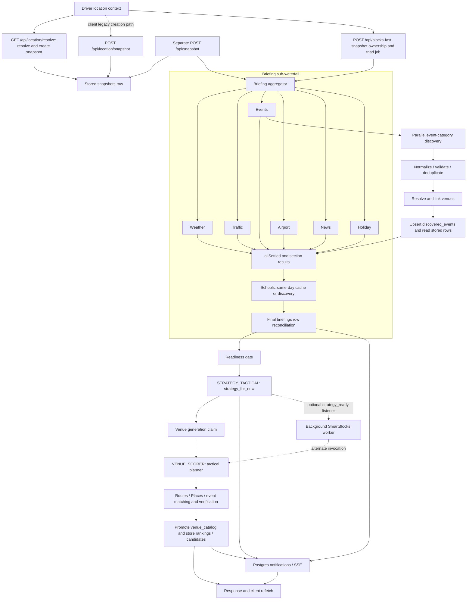

# VectoPilot pipeline baseline — September 7, 2026

Prepared by Astra's read-only pipeline review for Melody. Source: Windows clone `C:/Users/melod/OneDrive/Documents/GitHub/VectoPilot`, preservation branch `codex/vectopilot-mcp-preserve-20260907`, baseline `87a31c0`. No application edits, database queries, model requests, dependency installation, or scans were performed. This is a bounded initial map, not a complete release audit.

Melody reports duplicate signup, OAuth problems, empty development and production tables, unclear nested waterfalls, naming/endpoint ambiguity, monitoring/security/scaling gaps, and unfinished features. Those are owner-reported requirements; live OAuth and database emptiness were not verified by this review. Existing continuity tables were not queried. Source reading included `CLAUDE.md`, `AI_PARTNERSHIP_AGREEMENT.md`, `LEXICON.md`, the July 6 location/time audit (including Melody's amendments), roadmap documents, and current implementation.

## Actual principal waterfall

The six briefing calls start in parallel; schools runs after their `allSettled`. The client normally receives its snapshot from `/api/location/resolve` and has a legacy creation path through `/api/location/snapshot` (`location-context-clean.tsx:564`, `:664`). A separate mounted `POST /api/snapshot` also exists and awaits briefing before returning; no current client creation call to that path was found. The main blocks POST awaits briefing before tactical strategy, followed by venues. This differs from the older `ai-pipeline.md` diagram showing a parallel Strategist + Briefer phase. The background listener is an alternate venue invocation, not the main strategy generator. Its live enablement was not checked.

## Inputs, outputs, and write owners

| Boundary | Input and output | Current owner / evidence |
|---|---|---|
| Snapshot | Resolved location + time context → `snapshots` row | Main resolver writes at `server/api/location/location.js:1071`; legacy `/location/snapshot` writes at `:1888`. Separate `server/api/location/snapshot.js:37` also creates, validates at `:172`, inserts at `:175`, then invokes briefing at `:201`. These are multiple write owners that the contract inventory must reconcile. |
| Waterfall command | Authenticated snapshot → `triad_jobs`, strategy state and final response | `server/api/strategy/blocks-fast.js:755`; new job creates strategy row and runs sequential phases. |
| Briefing | Full snapshot → `briefings` section values and reasons | `server/lib/briefing/briefing-aggregator.js:41` owns dedup/placeholder/final assembly; seven `pipelines/*` modules own their progressive sections; `briefing-notify.js:65` writes sections and notifies. |
| Events | Category discoveries → normalized/validated events → venue-linked persistent event rows → briefing | `server/lib/briefing/pipelines/events.js:413`, `:558`, `:784`, `:975`; shared transforms in `server/lib/events/pipeline/`. Canonical records are read back from `discovered_events` joined to `venue_catalog`. |
| Tactical strategy | Snapshot + briefing + driver preferences/earnings context → `strategies.strategy_for_now` | `server/lib/ai/providers/consolidator.js:1351`; model role is `STRATEGY_TACTICAL`. |
| Venue recommendations | Strategy + snapshot + filtered briefing/live events → `rankings`, `ranking_candidates`, venue catalog promotions | `server/lib/venue/enhanced-smart-blocks.js:398`; `generateTacticalPlan` in `server/lib/strategy/tactical-planner.js:197`; ranking write `enhanced-smart-blocks.js:546`, candidates `:651`. |
| Alternate venue worker | `strategy_ready` notification → same venue engine | `server/jobs/triad-worker.js:36` and `:127`; entry is misleadingly called `startConsolidationListener`, although its own implementation says it does no consolidation. |
| Realtime delivery | Stored rows + stage notifications → client wake-up/refetch | `server/api/strategy/strategy-events.js`; shared LISTEN dispatcher in `server/db/db-client.js`; per-section channels in `briefing-notify.js:23`. |
| Separate MCP | Authenticated MCP clients → continuity-table operations + read-only repo tools | `mcp-server.js`, `server/mcp/*`; distinct process/token/port from `/agent`. Preserve this explicit owner boundary. |

## Endpoint distinctions that need an explicit contract

Mount order is centralized in `server/bootstrap/routes.js`. That is a useful starting point for a generated inventory, but it also mounts `/agent` and an SDK catch-all after ordinary routes.

| Existing surface | Actual purpose / ambiguity |
|---|---|
| `POST /api/blocks-fast` | Full strategy/venue command. “Fast” describes neither resource nor guaranteed latency. |
| `GET /api/blocks-fast?snapshotId=...` | Can generate missing blocks, so a GET may have costly side effects. |
| `GET /api/blocks/strategy/:snapshotId` | Polling view of strategy + blocks; separate from similarly named `/api/strategy/:snapshotId`. Despite its read-only header it may update phase to `complete` (`content-blocks.js:211`). |
| `/api/location/resolve`, `/api/location/snapshot`, `/api/snapshot` | Multiple snapshot creation paths, with different side effects; client primarily uses the resolver and the first snapshot POST. |
| `POST /api/strategy/tactical-plan` | Mission-specific staging/avoid analysis using `STRATEGY_CONTEXT`; distinct from `tactical-planner.js` which generates venue recommendations using `VENUE_SCORER`. |
| `/api/briefing/generate`, `/refresh`, `/snapshot/:id`, `/current`, section reads | Multiple entry/read/refresh paths must share one lifecycle and ownership contract; they are not all interchangeable. |
| `/api/diagnostic` and `/api/diagnostics` | Separate modules whose near-identical names obscure their purpose. |
| `/api/chat`, `/api/coach`, `/api/realtime`, `/api/gemini-live` | Chat, coach data/notes, and distinct voice transports; require explicit audience/permissions/side-effect descriptions. |
| `/api/hooks/*` and `/api/offer-analyzer/*` | Shortcut ingestion versus signed-in rule/history/outcome editing. Keep identity and credential boundaries clear. |

Do not do a cosmetic rename sweep. The existing lexicon already defines role names such as `BRIEFING_*`, `STRATEGY_*`, and `VENUE_*`, including legacy aliases. First reconcile terminology and contract intent, then migrate callers with compatibility/deprecation coverage. `LEXICON.md` itself has a stale blocks GET parameter example (`snapshot_id` versus the route's documented `snapshotId`).

## Concrete gaps to resolve before calling the pipeline clean

1. **Readiness is not the same as success.** `blocks-fast.js:810-870` treats any non-null section as ready, including a failure marker; it logs a 90-second readiness timeout and proceeds. `consolidator.js:1381-1391` rejects only when both traffic and events are null. Define which failed/empty sections permit strategy generation, carry explicit state/reason, and test the permitted degraded modes. Do not infer intended behavior from comments saying “blocking.”
2. **One snapshot handoff differs from stored truth.** The separate `POST /api/snapshot` route at `snapshot.js:195-196` creates briefing context with `hour || null` and `dow || null`, so midnight and Sunday become null even when the validated stored row retained zero. Its manually reconstructed snapshot omits other row fields. This conflicts with the full-row downstream handoff requirement and deserves a targeted regression check, plus determination of whether this creation path remains supported; it was not established as the primary client path.
3. **Concurrency claims need evidence under multiple processes.** The blocks helper does use a transaction-scoped claim (`blocks-fast.js:171-218`). Briefing aggregation instead acquires/releases session-level advisory locks through separate pooled `db.execute` calls (`briefing-aggregator.js:52` / `:140`); the same PostgreSQL session is not pinned by that code. Its in-flight Map is also populated only after async setup. The optional worker calls venue generation directly. Cross-instance duplicate/restart tests are needed before accepting the comments claiming distributed deduplication.
4. **Monitoring has multiple unrelated meanings.** `/api/job-metrics` reads the in-memory `JobQueue` (`server/lib/infrastructure/job-queue.js`), not `triad_jobs`. No live `jobQueue.enqueue` call was found in `server/`; location imports it but its call site explicitly uses direct providers. A zero count therefore says little about waterfall health. `/api/ml-health` also queries historical columns/statuses (e.g. strategy `latency_ms`, `tokens`, `completed`) inconsistent with current schema/status surfaces; validate it against actual migrations before using it as an operational dashboard.
5. **Security is a route-level concern as well as login.** `tactical-plan.js:126-152` authenticates but reads the requested snapshot by ID without an ownership predicate/middleware. This is a code-verified authorization-gap candidate, not a performed cross-user exploit. `snapshot.js:177` also logs exact coordinates/address at normal log level despite nearby debug redaction work. Root review was notified.
6. **Capacity controls are local, not a proven fleet budget.** The model gate uses per-process Maps with 10 concurrent requests/provider and a 30-second queue timeout (`concurrency-gate.js`). PG pool is 25 per process (`connection-manager.js:24`). Rate limits use default in-process stores. Replica multiplication, provider quotas, connection budgets, job durability and overload behavior still need a measured policy.

## Existing mechanisms worth retaining

- Canonical model role dispatch, provider error classification, timeouts, retry/fallback controls and concurrency statistics exist in `server/lib/ai/adapters/index.js` and `router/`.
- Briefing branches have independent errors and progressive per-section notification; final row reconciliation remains authoritative. Failed discovery versus verified-empty is explicitly distinguished for events.
- Event normalization, hard validation, hashes, venue linkage and validation-schema versioning exist; cleanup is opportunistic rather than proof of a scheduled maintenance process.
- Shared LISTEN reconnection, subscriber cleanup, SSE heartbeat, and replay/refetch-on-connect paths already exist. These need failure/reconnect tests, not a replacement based only on the word “monitoring.”
- Authentication, snapshot ownership guards on several read routes, costly-endpoint limiters, MCP bearer guard/body limit/session cap, structured workflow logs and pool warnings are present. Their existence does not establish coverage of every route or live configuration.

## Completion checks for the roadmap

- [ ] Generate an endpoint contract inventory from mounts and handlers: method, audience, auth/ownership, input/output schema, side effects, timeout and upstream dependencies. Flag duplicate/near names and GET mutations.
- [ ] Publish one reviewed nested waterfall map with stable stage names, exact model roles, parent/child run IDs, input artifacts, write owner, lifecycle and failure policy; correct older contradictory diagrams.
- [ ] Use the validated complete snapshot as downstream context; test midnight/Sunday, GPS/device timezone disagreement, six-decimal coordinates and missing required fields.
- [ ] Represent each briefing section as pending/ready/verified-empty/failed with reason; prove every strategy gate responds correctly to each state and to timeout.
- [ ] Prove same-snapshot retry, concurrent commands, worker-plus-request, two replicas, process death and DB reconnect do not create duplicate paid work or partial duplicate rankings.
- [ ] Verify dev/prod schema and required reference data separately using authorized read-only inspection; distinguish legitimately empty user data from missing seed/migration data. Never copy private production rows to dev as a shortcut.
- [ ] Monitor the actual waterfall and offer phases: latency percentiles, failures by stage, queue age, retries, rows produced, stale pending rows, provider spend, DB capacity, SSE reconnects and integrity failures; show environment/run identifiers without precise GPS or credentials.
- [ ] Test route ownership and public-hook token isolation across two accounts; redact sensitive location logs and give internal monitoring an appropriate administrative role.
- [ ] Run a bounded concurrency/load test with stubbed external providers first; then establish real quota/cost budgets and a durable retry owner for post-response work.
- [ ] Reconcile unfinished features against current code and live `todo` rather than counting old TODO strings; attach user-flow acceptance evidence to each release item.

## Unfinished-feature sources, not verified current counts

`docs/MASTER_ROADMAP.md` lists Uber sync/earnings analytics, asynchronous waterfall, coach continuity, and concierge work, but contains historical claims requiring revalidation. The newer `docs/architecture/OFFER_ANALYZER_ROADMAP.md` (August 26 additions) records setup refresh, phase-two delivery/durability, learning-loop integration and a native shell. In particular its phase-two durability note says the work continues in-process after the response rather than through a durable worker. This review did not re-execute that offer flow. The owner's new OAuth/duplicate signup findings take priority over these older summaries.
