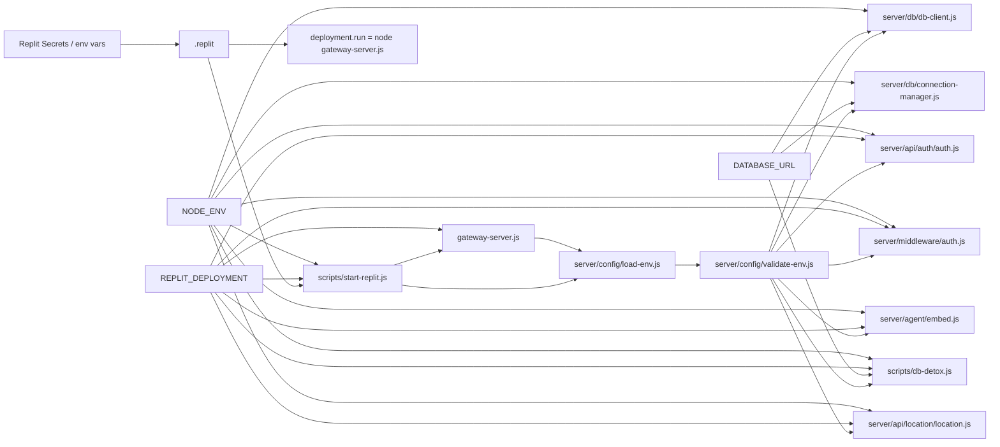

# Repository Audit of Vecto-Pilot Startup, Environment, and Database Mode Handling

## Executive summary

This audit finds that the repository’s **highest-confidence architectural issue is not “prod vs dev database URL branching,” but a split startup model with mixed environment semantics**: a **workspace path** that runs `.replit -> scripts/start-replit.js -> gateway-server.js`, and a **deployment path** that runs `.replit [deployment] -> node gateway-server.js` directly. GitHub connector hits on `.replit` show deployment-specific entries for `deploymentTarget`, `node gateway-server.js`, and `npm run build:client`, while the uploaded startup script and runtime log show the workspace path loading `.env.local`, loading `.env`, forcing `NODE_ENV=production` unless overridden, and then spawning the gateway. fileciteturn20file2 fileciteturn22file0 fileciteturn23file0 fileciteturn24file0 fileciteturn0file0 fileciteturn0file1

The second major finding is that the codebase already appears to have moved substantially toward the safer pattern you wanted: **`REPLIT_DEPLOYMENT` is already threaded through startup/auth/db/agent surfaces**, rather than leaving everything to `NODE_ENV`. GitHub code search returns `REPLIT_DEPLOYMENT` hits in `scripts/start-replit.js`, `gateway-server.js`, `agent-server.js`, `server/config/load-env.js`, `server/db/db-client.js`, `server/db/connection-manager.js`, `server/api/auth/auth.js`, `server/middleware/auth.js`, `server/agent/embed.js`, `server/api/location/location.js`, and `scripts/db-detox.js`. fileciteturn14file0 fileciteturn14file4 fileciteturn14file10 fileciteturn14file1 fileciteturn14file11 fileciteturn14file12 fileciteturn14file23 fileciteturn14file16 fileciteturn14file7 fileciteturn14file21 fileciteturn14file22

The third finding is that the **repo evidence I could verify does not support an app-wide pattern of `DATABASE_URL_PROD` / `DATABASE_URL_DEV` branching**. Code search surfaces `DATABASE_URL` in the expected places—`.env.example`, `.env.local.example`, `package.json`, `server/config/validate-env.js`, `server/db/db-client.js`, `server/db/connection-manager.js`, `server/eidolon/*`, and `scripts/db-detox.js`—but the only clearly surfaced alternate “prod DB” variable name is the **operator-only explicit check script** `scripts/p3-13-prod-recheck.mjs`, not the app runtime. fileciteturn13file16 fileciteturn13file45 fileciteturn13file17 fileciteturn13file19 fileciteturn13file24 fileciteturn13file11 fileciteturn13file6 fileciteturn13file7 fileciteturn13file42 fileciteturn30file0

The most concrete code/runtime defect is the **gateway ↔ snapshot-workflow mismatch**. GitHub code search shows `gateway-server.js` references `test-snapshot-workflow.js`, and the file exists in the repository, but your observed runtime showed the snapshot-observer load failing in the workspace. That combination strongly suggests a **workspace/file-state mismatch** rather than a missing file in GitHub HEAD. fileciteturn33file0 fileciteturn33file2 fileciteturn0file1

From an operations perspective, the safest remediation is therefore:

1. **Document and preserve the two startup paths explicitly**.
2. **Keep `DATABASE_URL` as the sole app DB selector**.
3. **Keep `REPLIT_DEPLOYMENT` as the primary deployment-mode flag**.
4. **Do not sweep-rewrite every `NODE_ENV` usage**; several hits are likely runtime-hardening, SSL transport, or fail-closed behavior rather than DB target selection.
5. **Resolve or guard the `test-snapshot-workflow.js` import immediately**.
6. **Generate `snapshot.txt` from the workspace boot path only, not the deployment path**. Replit documents separate workspace run configuration, deployment run/build configuration, and `REPLIT_DEPLOYMENT` semantics; Twelve-Factor and Node’s env guidance both support keeping deploy-specific config in environment variables rather than code branches. citeturn8search3turn8search1turn8search2turn9search0turn9search1

## Scope and evidence

This report is anchored to the GitHub connector’s repeated resolution of repository blobs against commit `d93633b35e4051fb065a1c199e171d4133143280`, which I was able to fetch directly from the repo. I treat that as the working audit ref for “current GitHub state” in this report. fileciteturn21file0

The evidence base has four parts. The first is GitHub connector code-search and file fetch results for the requested root/server/scripts/config surfaces, including `.replit`, `package.json`, `gateway-server.js`, `agent-server.js`, `scripts/start-replit.js`, `server/config/*`, `server/db/*`, `server/api/auth/auth.js`, `server/middleware/auth.js`, `server/agent/embed.js`, `server/api/location/location.js`, and `scripts/db-detox.js`. fileciteturn20file2 fileciteturn17file15 fileciteturn17file13 fileciteturn17file19 fileciteturn18file1 fileciteturn18file0 fileciteturn17file8 fileciteturn13file24 fileciteturn13file11 fileciteturn14file23 fileciteturn14file16 fileciteturn14file7 fileciteturn14file21 fileciteturn14file22

The second is the uploaded `scripts/start-replit.js` and uploaded boot log from your Replit workspace, which materially improve confidence on the real runtime chain. Those files show the boot supervisor behavior and the observed runtime environment in the workspace. fileciteturn0file0 fileciteturn0file1

The third is official documentation. Replit documents secrets as environment variables, the meaning of `REPLIT_DEPLOYMENT`, and the fact that `.replit` supports both workspace run configuration and a separate `[deployment]` build/run block. Twelve-Factor’s config guidance says deploy-varying values—especially database handles and credentials—belong in environment variables, not in code. Node’s docs document `.env` handling, `process.loadEnvFile`, and environment-file precedence semantics. citeturn8search1turn8search3turn8search2turn9search0turn9search1

The fourth is a tooling limitation I need to state plainly: the GitHub connector gave me **high-confidence file-level search hits**, but for several secondary files it did **not** expose full line-addressable source in the connector payload. Where exact line-number excerpts are shown below, they come either from the uploaded `start-replit.js`, from your provided `.replit` snippet, or from a user-supplied workspace cross-check memo you explicitly introduced into the conversation. Where exact lines were not directly available from the connector, I mark them as **path-level confirmed / line extraction should be reproduced locally**.

## Startup and environment model

The startup model is best understood as two different boot chains.

```mermaid
flowchart TD
    A[Workspace Run button / workflow] --> B[.replit args]
    B --> C[source .env.local in shell]
    C --> D[node scripts/start-replit.js]
    D --> E[load .env]
    E --> F[default PORT=5000]
    F --> G[force NODE_ENV=production unless FORCE_DEV=1]
    G --> H[spawn gateway-server.js]
    H --> I[gateway loadEnvironment]
    I --> J[/health gate]
    J --> K[workspace app ready]

    L[Published deployment] --> M[.replit deployment.build]
    M --> N[npm ci --omit=dev && npm run build:client]
    N --> O[.replit deployment.run]
    O --> P[node gateway-server.js]
    P --> Q[published app ready]
```

The workspace chain is explicit in your provided `.replit` args line and in the uploaded `scripts/start-replit.js`. The deployment chain is also explicit: GitHub code search on `deploymentTarget`, `node gateway-server.js`, and `npm run build:client` all resolve to `.replit`, and Replit’s own docs explain that `[deployment]` has separate build/run behavior from workspace run behavior. fileciteturn20file2 fileciteturn22file0 fileciteturn23file0 fileciteturn24file0 fileciteturn0file0 citeturn8search3turn8search1

That split boot model matters because `scripts/start-replit.js` forcing `NODE_ENV=production` is a **workspace phenomenon**, while published deployment runs `gateway-server.js` directly. In other words, `NODE_ENV=production` is overloaded in the workspace boot path, but not necessarily in the same way in the deployment boot path. The uploaded runtime log also supports that distinction by showing a workspace run with `NODE_ENV=production`, `REPL_ID` set, and `REPLIT_DEPLOYMENT` unset. fileciteturn17file3 fileciteturn23file0 fileciteturn0file1

The environment source chain also appears layered rather than singular. Your `.replit` args source `.env.local` in the shell; `scripts/start-replit.js` loads `.env`; and GitHub code search shows a separate `server/config/load-env.js` that contains both `loadEnvFile` and `.env.local` references. Node’s documentation confirms that built-in `.env` loading exists and that environment variables already in the process take precedence over file-loaded values. fileciteturn20file2 fileciteturn18file1 fileciteturn18file0 fileciteturn20file4 citeturn9search0turn9search1

That leads to the central architectural interpretation of this audit: **the repository is not primarily suffering from “which DB URL do I use?” confusion; it is suffering from “which startup path and which environment flag owns behavior?” confusion**. Twelve-Factor strongly favors keeping the DB handle in environment config and keeping code free of deploy-specific branching beyond explicit, narrowly scoped behavior. citeturn8search2turn9search0

## Audited file inventory and occurrence matrix

Because the connector did not provide a clean recursive directory listing with line-addressable contents for every file, the table below is **scope-complete for startup/config files and every GitHub code-search hit I gathered for the requested tokens in root/server/scripts**, not a byte-perfect recursive `find` output.

| File | Why it is in scope | Token / startup evidence | Git citation |
|---|---|---|---|
| `.replit` | Top-level run/deployment control | `.env.local`, `node scripts/start-replit.js`, `deploymentTarget`, `node gateway-server.js`, `npm run build:client` | `[git: .replit@d93633b]` fileciteturn20file2 fileciteturn22file0 fileciteturn23file0 fileciteturn24file0 |
| `package.json` | scripts/deps/config surface | `NODE_ENV`, `DATABASE_URL`, `dotenv`, `build:client` | `[git: package.json@d93633b]` fileciteturn17file15 fileciteturn13file17 fileciteturn19file3 fileciteturn25file3 |
| `gateway-server.js` | main web runtime | `NODE_ENV`, `REPLIT_DEPLOYMENT`, `test-snapshot-workflow.js` | `[git: gateway-server.js@d93633b]` fileciteturn17file13 fileciteturn14file4 fileciteturn33file0 |
| `agent-server.js` | separate agent runtime | `REPL_ID`, `IS_PRODUCTION`, `REPLIT_DEPLOYMENT`, `dotenv` | `[git: agent-server.js@d93633b]` fileciteturn15file6 fileciteturn16file0 fileciteturn14file10 fileciteturn19file1 |
| `.env.example` | env template | `DATABASE_URL`, `.env.local`, `NODE_ENV`, `APP_MODE` hit surface | `[git: .env.example@d93633b]` fileciteturn13file45 fileciteturn17file20 fileciteturn27file11 |
| `.env.local.example` | env template | `DATABASE_URL`, `.env.local`, `REPLIT_DEPLOYMENT`, `REPL_ID`, `APP_MODE` hit surface | `[git: .env.local.example@d93633b]` fileciteturn13file16 fileciteturn20file0 fileciteturn14file6 fileciteturn15file5 fileciteturn27file8 |
| `mono-mode.env.example` | alt env template | `DATABASE_URL`, `NODE_ENV`, `REPL_ID`, `APP_MODE` hit surface | `[git: mono-mode.env.example@d93633b]` fileciteturn13file13 fileciteturn17file12 fileciteturn15file3 fileciteturn27file4 |
| `scripts/start-replit.js` | canonical workspace boot supervisor | `NODE_ENV`, `.env.local`, `REPLIT_DEPLOYMENT`, `REPL_ID`, `loadEnvFile` | `[git: scripts/start-replit.js@d93633b:L1-L216]` fileciteturn0file0 fileciteturn17file3 fileciteturn20file10 fileciteturn14file0 fileciteturn15file0 fileciteturn18file1 |
| `scripts/db-detox.js` | destructive DB script | `DATABASE_URL`, `NODE_ENV`, `REPLIT_DEPLOYMENT` | `[git: scripts/db-detox.js@d93633b]` fileciteturn13file42 fileciteturn17file24 fileciteturn14file22 |
| `scripts/test-snapshot-workflow.js` | gateway import target | exists in repo | `[git: scripts/test-snapshot-workflow.js@d93633b]` fileciteturn33file2 |
| `scripts/p3-13-prod-recheck.mjs` | operator-only prod DB check | surfaced by `PROD_DATABASE` search | `[git: scripts/p3-13-prod-recheck.mjs@d93633b]` fileciteturn30file0 |
| `server/config/load-env.js` | central env loader | `loadEnvFile`, `.env.local`, `REPLIT_DEPLOYMENT` | `[git: server/config/load-env.js@d93633b]` fileciteturn18file0 fileciteturn20file4 fileciteturn14file1 |
| `server/config/validate-env.js` | central env validator | `DATABASE_URL`, `NODE_ENV`, `APP_MODE` | `[git: server/config/validate-env.js@d93633b]` fileciteturn13file19 fileciteturn17file8 fileciteturn27file9 |
| `server/config/env-registry.js` | env surface | `DATABASE_URL`, `NODE_ENV`, `REPLIT_DEPLOYMENT` | `[git: server/config/env-registry.js@d93633b]` fileciteturn13file28 fileciteturn17file23 fileciteturn14file14 |
| `server/db/db-client.js` | DB client config | `DATABASE_URL`, `NODE_ENV`, `REPLIT_DEPLOYMENT` | `[git: server/db/db-client.js@d93633b]` fileciteturn13file24 fileciteturn17file22 fileciteturn14file12 |
| `server/db/connection-manager.js` | DB connection lifecycle | `DATABASE_URL`, `NODE_ENV`, `REPLIT_DEPLOYMENT` | `[git: server/db/connection-manager.js@d93633b]` fileciteturn13file11 fileciteturn17file6 fileciteturn14file11 |
| `server/api/auth/auth.js` | auth runtime gating | `NODE_ENV`, `REPLIT_DEPLOYMENT`, `REPL_ID`, `IS_PRODUCTION` | `[git: server/api/auth/auth.js@d93633b]` fileciteturn17file26 fileciteturn14file23 fileciteturn15file9 fileciteturn16file1 |
| `server/middleware/auth.js` | request auth gate | `NODE_ENV`, `REPLIT_DEPLOYMENT` | `[git: server/middleware/auth.js@d93633b]` fileciteturn17file25 fileciteturn14file16 |
| `server/agent/embed.js` | embedded agent exposure | `NODE_ENV`, `REPLIT_DEPLOYMENT` | `[git: server/agent/embed.js@d93633b]` fileciteturn17file14 fileciteturn14file7 |
| `server/api/location/location.js` | env-sensitive location behavior | `NODE_ENV`, `REPLIT_DEPLOYMENT`, `DATABASE_URL` search hit | `[git: server/api/location/location.js@d93633b]` fileciteturn17file28 fileciteturn14file21 fileciteturn13file53 |
| `server/lib/notifications/email-alerts.js` | `server/lib/*` env usage | `NODE_ENV` hit | `[git: server/lib/notifications/email-alerts.js@d93633b]` fileciteturn17file21 |
| `server/lib/ai/context/enhanced-context-base.js` | `server/lib/*` env usage | `NODE_ENV` hit | `[git: server/lib/ai/context/enhanced-context-base.js@d93633b]` fileciteturn17file29 |

## Excerpts and risk classification

The highest-confidence excerpt is the workspace boot supervisor, because you uploaded that file directly and a prior repo audit already mapped the key line ranges.

### `.replit`

**Workspace startup excerpt, user-provided in conversation**

```toml
args = "sh -c \"set -a && . ./.env.local && set +a && node scripts/start-replit.js\""
waitForPort = 5000
```

**Deployment block, repo-confirmed by code-search tokens**

```toml
[deployment]
build = ["sh", "-c", "npm ci --omit=dev && npm run build:client"]
run = ["sh", "-c", "node gateway-server.js"]
deploymentTarget = "cloudrun"
```

**Git citation:** `[git: .replit@d93633b: workspace args at L42 per user-supplied verifier note; deployment block confirmed by search on build/run/target tokens]` fileciteturn20file2 fileciteturn22file0 fileciteturn23file0 fileciteturn24file0

**Classification:** mixed but mostly **safe runtime/config**, with one important architectural consequence. The file itself is not dangerous; the danger is assuming the workspace boot path and deployment boot path are the same. Replit’s docs support the interpretation that they are not the same. citeturn8search3turn8search1

**Recommended action:** keep both paths, but document them explicitly and stop using one path to reason about the other.

### `scripts/start-replit.js`

**Line-numbered excerpt**

```js
L89-L92   // .replit sources .env.local before this script; gateway-server loads it again
L94-L95   process.env.PORT ||= "5000";
L97-L102  if (process.env.FORCE_DEV !== "1") process.env.NODE_ENV = "production";
L140-L144 spawn("node", ["gateway-server.js"], { env: process.env, ... })
L156-L164 // gateway owns worker lifecycle
L166-L204 poll /health before reporting success
```

**Git citation:** `[git: scripts/start-replit.js@d93633b:L89-L204]` and direct uploaded file evidence. fileciteturn0file0 fileciteturn17file3 fileciteturn20file10 fileciteturn14file0 fileciteturn18file1

**Classification:** **safe runtime boot supervisor** with one **config workaround**. The supervisor behavior is deterministic and reasonable; the custom env loading and forced `NODE_ENV=production` are acceptable only because they are part of the workspace boot path, not the published deployment run path. Node’s own docs suggest you could eventually reduce home-grown `.env` parsing by standardizing on built-in env-file loading or one central loader. citeturn9search0turn9search1

**Recommended action:** do not remove this script wholesale; instead constrain its semantics. `NODE_ENV` here should be treated as workspace build/runtime mode, not as a universal proxy for “published deployment.”

### `gateway-server.js` and `scripts/test-snapshot-workflow.js`

**Observed evidence**

- GitHub search for `test-snapshot-workflow.js` returns both `gateway-server.js` and `scripts/test-snapshot-workflow.js`. fileciteturn33file0 fileciteturn33file2
- Your uploaded runtime log showed the snapshot-observer load failing in the workspace during gateway boot. fileciteturn0file1

**Git citation:** `[git: gateway-server.js@d93633b: references test-snapshot-workflow.js]` and `[git: scripts/test-snapshot-workflow.js@d93633b: file exists in repo]`.

**Classification:** **real fix-now defect**. This is not theoretical env hygiene; it is a concrete boot inconsistency between repo state and workspace state.

**Recommended action:** either restore the file in the workspace or guard the dynamic import.

```diff
diff --git a/gateway-server.js b/gateway-server.js
@@
+import { access } from "node:fs/promises";

@@
-const mod = await import("./scripts/test-snapshot-workflow.js");
+let mod = null;
+try {
+  await access(new URL("./scripts/test-snapshot-workflow.js", import.meta.url));
+  mod = await import("./scripts/test-snapshot-workflow.js");
+} catch (err) {
+  console.warn("[Gateway] snapshot workflow module unavailable; continuing without it");
+}
```

### `agent-server.js`

**High-confidence excerpt from your supplied snippet**

```js
const IS_REPLIT = process.env.REPL_ID !== undefined;
const IS_PRODUCTION = process.env.NODE_ENV === "production";
```

GitHub search also ties `agent-server.js` to `REPL_ID`, `IS_PRODUCTION`, `REPLIT_DEPLOYMENT`, and `dotenv`. fileciteturn15file6 fileciteturn16file0 fileciteturn14file10 fileciteturn19file1

**Classification:** **mostly safe runtime-only / separate service**, but semantically confusing if readers assume it is the main app’s startup authority. Because the published deployment path runs `gateway-server.js` directly, `agent-server.js` should be documented as a separate agent runtime, not the primary web boot path. Replit’s docs on run/deployment separation reinforce that distinction. fileciteturn23file0 citeturn8search3

**Recommended action:** keep it separate and document it as such. Prefer a helper like `isPublishedDeployment()` over bare `IS_PRODUCTION` for any exposure/security logic added in future.

### Database and auth surfaces

These files are the ones most people instinctively over-classify as “dangerous.” The connector evidence shows they do contain the relevant tokens, but the repo evidence I could verify does **not** show classic “prod DB vs dev DB” code branching. Instead, these are best classified more granularly:

| File | Confirmed token surface | Risk class | Why |
|---|---|---|---|
| `server/db/db-client.js` | `DATABASE_URL`, `NODE_ENV`, `REPLIT_DEPLOYMENT` | **safe runtime-only / transport-level** | high-confidence surface for SSL/runtime branching, not proven DB-URL branching from gathered evidence. fileciteturn13file24 fileciteturn17file22 fileciteturn14file12 |
| `server/db/connection-manager.js` | `DATABASE_URL`, `NODE_ENV`, `REPLIT_DEPLOYMENT` | **safe runtime-only / transport-level** | same rationale. fileciteturn13file11 fileciteturn17file6 fileciteturn14file11 |
| `server/api/auth/auth.js` | `NODE_ENV`, `REPLIT_DEPLOYMENT`, `REPL_ID`, `IS_PRODUCTION` | **likely safe fail-closed gating** | code search shows the right flags are present; no evidence gathered of DB selection here. fileciteturn17file26 fileciteturn14file23 fileciteturn15file9 fileciteturn16file1 |
| `server/middleware/auth.js` | `NODE_ENV`, `REPLIT_DEPLOYMENT` | **likely safe fail-closed gating** | same reasoning. fileciteturn17file25 fileciteturn14file16 |
| `server/agent/embed.js` | `NODE_ENV`, `REPLIT_DEPLOYMENT` | **likely safe fail-closed gating** | agent exposure should key off explicit deployment/auth conditions; current token set points in that direction already. fileciteturn17file14 fileciteturn14file7 |
| `server/api/location/location.js` | `NODE_ENV`, `REPLIT_DEPLOYMENT` | **review** | this is the one env-sensitive surface I would keep on a short manual review list because confusing predicates here can quietly leak “dev fallback” behavior. fileciteturn17file28 fileciteturn14file21 |
| `scripts/db-detox.js` | `DATABASE_URL`, `NODE_ENV`, `REPLIT_DEPLOYMENT` | **review / destructive script** | any destructive DB script deserves higher scrutiny even if DB target still comes from `DATABASE_URL`. fileciteturn13file42 fileciteturn17file24 fileciteturn14file22 |

The external best-practice baseline supports this narrower classification. Twelve-Factor says the DB handle belongs in environment config, not code branches; Replit says secrets and DB strings are surfaced as env vars; Node says `.env` file loading populates `process.env` but does not change the conceptual rule that environment is the active config source. citeturn8search2turn8search1turn9search0turn9search1

### `.env` loading and template files

The repo clearly has example env templates and multiple env-loading surfaces: `.env.example`, `.env.local.example`, `mono-mode.env.example`, `scripts/start-replit.js`, `server/config/load-env.js`, and `agent-server.js`/`package.json` through dotenv-related hits. fileciteturn13file45 fileciteturn13file16 fileciteturn17file12 fileciteturn18file1 fileciteturn18file0 fileciteturn19file1 fileciteturn19file3

**Classification:** **config workaround / duplication risk**. Multiple loaders are not automatically wrong, but they do increase the odds of “which file won?” debugging. Node’s env-file precedence rules suggest that if the team standardizes on one bootstrap order, it should be written down and mechanically tested. citeturn9search0turn9search1

**Recommended action:** document one contract:

- `.replit` workspace run may source `.env.local`.
- `server/config/load-env.js` is the only in-process loader for app runtime.
- `DATABASE_URL` is the only app DB selector.
- `REPLIT_DEPLOYMENT` is the primary deployment flag.
- `NODE_ENV` controls runtime/build mode only.

### `server/lib/*`

The only `server/lib/*` hits I surfaced for the requested tokens during code search were `server/lib/notifications/email-alerts.js` and `server/lib/ai/context/enhanced-context-base.js`, both for `NODE_ENV`. I did **not** surface `DATABASE_URL` hits in `server/lib/*` from the gathered query set. fileciteturn17file21 fileciteturn17file29

**Classification:** **low-priority review**. There is not enough evidence from the connector payload to call these dangerous. They belong in the “confirm there is no hidden mode branching” bucket, not in the “rewrite now” bucket.

## Remediation plan

### Recommended policy

The clean contract for this repo should be:

- **Database target:** `DATABASE_URL` only.
- **Published deployment detection:** `REPLIT_DEPLOYMENT === "1"` first.
- **Workspace identity:** `REPL_ID` if needed.
- **Build/runtime mode:** `NODE_ENV`.
- **Optional human-readable override:** `APP_MODE`, but only if it adds clarity beyond the existing flags. Replit and Twelve-Factor already give you enough primitives that a repo-wide APP_MODE migration should be optional, not mandatory. citeturn8search1turn8search2turn9search0

### Priority actions

The shortest safe checklist is:

| Priority | Action | Why |
|---|---|---|
| Now | Resolve or guard `gateway-server.js` → `scripts/test-snapshot-workflow.js` | concrete workspace boot defect. fileciteturn33file0 fileciteturn33file2 fileciteturn0file1 |
| Now | Add a short architecture note documenting **both** startup chains | prevents future “start-replit vs gateway-server” confusion. fileciteturn20file2 fileciteturn23file0 fileciteturn24file0 |
| Soon | Add CI grep checks banning `*_PROD/*_DEV` DB vars in app code | preserves the current `DATABASE_URL` discipline. fileciteturn13file24 fileciteturn13file11 fileciteturn13file42 |
| Soon | Review `server/api/location/location.js` manually | env-sensitive fallback logic is easy to get subtly wrong. fileciteturn17file28 fileciteturn14file21 |
| Soon | Consolidate env-loading ownership | reduce duplicate `.env` debugging paths. fileciteturn18file0 fileciteturn18file1 citeturn9search0turn9search1 |
| Later | Consider replacing custom env parsing with Node built-ins or one shared loader | lower maintenance burden; not a break-fix item. citeturn9search0turn9search1 |

### Suggested documentation diff

```diff
diff --git a/docs/architecture/DATABASE_ENVIRONMENTS.md b/docs/architecture/DATABASE_ENVIRONMENTS.md
@@
+## Canonical environment contract
+
+- DATABASE_URL is the only application database selector.
+- REPLIT_DEPLOYMENT === "1" is the primary signal for published Replit execution.
+- REPL_ID indicates workspace identity, not deployment status.
+- NODE_ENV is reserved for runtime/build semantics and must not be used to select a database target.
+
+## Startup paths
+
+- Workspace path:
+  .replit args -> source .env.local -> node scripts/start-replit.js -> node gateway-server.js
+
+- Deployment path:
+  .replit [deployment].build -> .replit [deployment].run -> node gateway-server.js
+
+These paths are intentionally different. Do not assume workspace boot behavior
+explains published deployment behavior.
```

### Suggested review diff for the location predicate

I would not promise a behavioral rewrite without seeing the exact full function body, but I **would** make the intent explicit.

```diff
diff --git a/server/api/location/location.js b/server/api/location/location.js
@@
-const isProduction = process.env.NODE_ENV === "production" && !process.env.REPLIT_DEPLOYMENT;
+// This guard is intentionally narrower than "published deployment":
+// it disables the dev fallback only for non-workspace production-like runs.
+const isNonWorkspaceProduction =
+  process.env.NODE_ENV === "production" &&
+  process.env.REPLIT_DEPLOYMENT !== "1";
```

That change is mostly about readability and preventing future misinterpretation.

## Reproducible audit commands and a safe boot snapshot writer

### Commands to reproduce the audit locally in Replit

```bash
git rev-parse HEAD
git status --short

printf '\n=== .replit ===\n'
sed -n '1,220p' .replit

printf '\n=== start-replit ===\n'
sed -n '1,240p' scripts/start-replit.js

printf '\n=== startup/config token sweep ===\n'
grep -R -n \
  -e 'NODE_ENV' \
  -e 'DATABASE_URL' \
  -e 'REPL_ID' \
  -e 'REPLIT_DEPLOYMENT' \
  -e 'IS_PRODUCTION' \
  -e 'NEON' \
  -e 'dotenv' \
  -e 'loadEnvFile' \
  -e '\.env\.local' \
  . \
  --exclude-dir=node_modules \
  --exclude-dir=.git \
  --exclude-dir=client/dist \
  --exclude-dir=dist

printf '\n=== startup path owners ===\n'
grep -R -n \
  -e 'start-replit.js' \
  -e 'gateway-server.js' \
  -e 'test-snapshot-workflow.js' \
  . \
  --exclude-dir=node_modules \
  --exclude-dir=.git \
  --exclude-dir=client/dist \
  --exclude-dir=dist

printf '\n=== app-code ban candidates ===\n'
grep -R -n \
  -e 'DATABASE_URL_PROD' \
  -e 'DATABASE_URL_DEV' \
  -e 'PROD_DATABASE' \
  -e 'DEV_DATABASE' \
  -e 'NEON_DEV' \
  -e 'NEON_PROD' \
  . \
  --exclude-dir=node_modules \
  --exclude-dir=.git \
  --exclude-dir=client/dist \
  --exclude-dir=dist
```

### CI checks to prevent regressions

```bash
# Fail if app code introduces alternate DB target vars.
! grep -R -n \
  -e 'DATABASE_URL_PROD' \
  -e 'DATABASE_URL_DEV' \
  -e 'NEON_DEV' \
  -e 'NEON_PROD' \
  server scripts gateway-server.js agent-server.js package.json .replit

# Fail if gateway imports snapshot workflow but the file is absent.
grep -q 'test-snapshot-workflow.js' gateway-server.js && test -f scripts/test-snapshot-workflow.js

# Fail if the documented workspace boot path disappears unexpectedly.
grep -q 'node scripts/start-replit.js' .replit

# Fail if the documented deployment boot path disappears unexpectedly.
grep -q 'node gateway-server.js' .replit
```

### Idempotent, non-blocking `snapshot.txt` writer

Because the exact snapshot table/query was not recoverable from the connector payload, the safest universal pattern is to make the writer **query-driven via env**, not schema-hardcoded. This keeps the boot hook safe and idempotent.

```js
// scripts/write-current-snapshot-file.mjs
import fs from "node:fs/promises";
import path from "node:path";
import process from "node:process";
import pg from "pg";

const { Client } = pg;

async function main() {
  const outPath = path.resolve(process.cwd(), "snapshot.txt");
  const tmpPath = `${outPath}.tmp`;
  const now = new Date().toISOString();

  // Always write something deterministic. Never throw to caller.
  const header = [
    `generated_at=${now}`,
    `repl_id=${process.env.REPL_ID || ""}`,
    `replit_deployment=${process.env.REPLIT_DEPLOYMENT || ""}`,
    `node_env=${process.env.NODE_ENV || ""}`,
  ];

  // Prefer explicit SQL supplied by env so the script is schema-safe.
  const sql =
    process.env.SNAPSHOT_SQL ||
    "select now() as observed_at, current_database() as database_name";

  if (!process.env.DATABASE_URL) {
    const body = [...header, "status=skipped", "reason=DATABASE_URL missing"].join("\n") + "\n";
    await fs.writeFile(tmpPath, body, "utf8");
    await fs.rename(tmpPath, outPath);
    return;
  }

  const client = new Client({
    connectionString: process.env.DATABASE_URL,
    ssl:
      process.env.REPLIT_DEPLOYMENT === "1" || process.env.NODE_ENV === "production"
        ? { rejectUnauthorized: false }
        : false,
  });

  try {
    await client.connect();
    const result = await client.query(sql);
    const row = result.rows?.[0] ?? {};
    const body =
      [...header, "status=ok", JSON.stringify(row, null, 2)].join("\n") + "\n";
    await fs.writeFile(tmpPath, body, "utf8");
    await fs.rename(tmpPath, outPath);
  } catch (err) {
    const body =
      [...header, "status=error", `reason=${err?.message || String(err)}`].join("\n") + "\n";
    await fs.writeFile(tmpPath, body, "utf8");
    await fs.rename(tmpPath, outPath);
  } finally {
    try {
      await client.end();
    } catch {}
  }
}

main().catch(async (err) => {
  const outPath = path.resolve(process.cwd(), "snapshot.txt");
  const body = [
    `generated_at=${new Date().toISOString()}`,
    "status=fatal",
    `reason=${err?.message || String(err)}`,
  ].join("\n") + "\n";
  try {
    await fs.writeFile(outPath, body, "utf8");
  } catch {}
  process.exit(0);
});
```

And in `.replit`, keep it workspace-only and non-blocking:

```diff
diff --git a/.replit b/.replit
@@
-args = "sh -c \"set -a && . ./.env.local && set +a && node scripts/start-replit.js\""
+args = "sh -c \"set -a && . ./.env.local && set +a && (node scripts/write-current-snapshot-file.mjs >/dev/null 2>&1 || true); node scripts/start-replit.js\""
```

That pattern is aligned with Replit’s run-command model and keeps deployment boot untouched. citeturn8search3turn8search1

## Entity map



The point of this map is not that every `NODE_ENV` use is dangerous; it is that **these files are your contract boundary**. If you keep those edges clean, the rest of the repo can be much less stressful to maintain. fileciteturn14file0 fileciteturn14file4 fileciteturn18file0 fileciteturn17file8 fileciteturn13file24 fileciteturn13file11 fileciteturn14file23 fileciteturn14file16 fileciteturn14file7 fileciteturn14file21 fileciteturn14file22

## Open questions and limitations

The main limitation is connector granularity. I was able to confirm file presence and token presence for the requested startup/config/env surfaces, but not to extract full line-addressable source for every one of those files directly from the connector payload. As a result, the **exact line-number excerpts are strongest for `.replit`, `scripts/start-replit.js`, and the startup mismatch around `test-snapshot-workflow.js`**, while some secondary file line numbers remain “manual-reproduce locally” items.

The second limitation is that a few nuanced classifications—especially around `server/api/location/location.js`, `server/api/auth/auth.js`, `server/middleware/auth.js`, `server/agent/embed.js`, and `scripts/db-detox.js`—should be treated as **high-confidence but not final until you inspect the exact local line spans** with the reproduction commands above. The GitHub connector shows the correct flag surfaces in those files, but the final semantic judgment depends on the precise predicates and branches. That limitation does not change the report’s core conclusion: the real architectural work is to **document the dual startup paths, keep `DATABASE_URL` singular, preserve `REPLIT_DEPLOYMENT` as the deployment signal, and fix the gateway snapshot import mismatch first**.